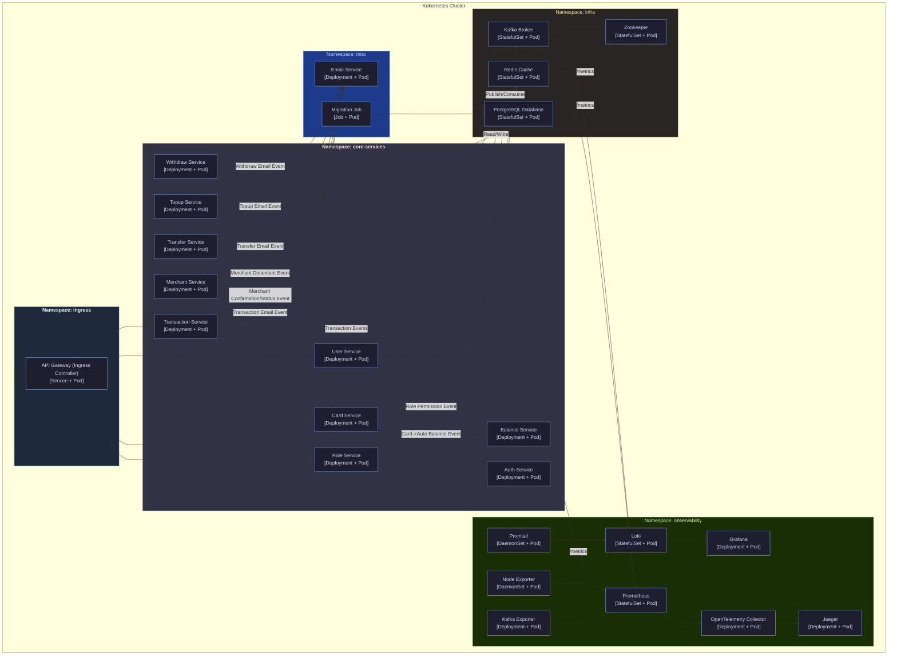

# 💳 Distributed Modular Monolith Payment Gateway

Proyek ini adalah **Implementasi Distribute Modular Monolith Payment Gateway** dari **Sistem Gerbang Pembayaran**. Arsitektur ini dirancang untuk menyediakan **backend yang aman, dapat diskalakan, dan modular** untuk menangani transaksi keuangan, pembayaran merchant, operasi kartu, dan alur penyelesaian.

Tidak seperti monolit tradisional, sistem ini disusun menjadi **modul (layanan) yang terdefinisi dengan baik** seperti **Auth, Pengguna, Peran, Kartu, Saldo, Transaksi, Merchant, Transfer, Isi Ulang, Tarik Tunai**, dll. Setiap modul berkomunikasi secara internal melalui **gRPC** dan secara eksternal melalui **API Gateway (NGINX)**. Peristiwa dipublikasikan melalui **Kafka** untuk alur kerja asinkron yang digerakkan oleh peristiwa (misalnya, penyelesaian, notifikasi email, pembaruan saldo).

Di lapisan infrastruktur, sistem terintegrasi dengan:

*   **PostgreSQL** sebagai basis data relasional inti.
*   **Redis** untuk caching dan manajemen sesi waktu nyata.
*   **Kafka** (dengan Zookeeper) sebagai bus acara untuk pemrosesan asinkron.
*   **Layanan Email** untuk mengirim konfirmasi, penyelesaian, dan notifikasi transaksional.
*   **Tumpukan Observabilitas** (Prometheus, Grafana, Loki, Jaeger, OpenTelemetry) untuk pemantauan, pencatatan, dan pelacakan di seluruh ekosistem.

Penerapan dapat dijalankan di:

*   **Docker Compose** untuk pengembangan dan pengujian lokal yang lengkap.
*   **Kubernetes** untuk lingkungan tingkat produksi dengan penskalaan otomatis dan ketahanan.

---

## 🎯 Fitur Utama

*   **🔐 Manajemen Otentikasi & Peran**
    *   Otentikasi pengguna yang aman dengan JWT.
    *   Kontrol akses berbasis peran (admin, merchant, pelanggan, sistem).
    *   Izin disimpan di Redis untuk pencarian cepat.

*   **💳 Manajemen Kartu & Saldo**
    *   Pendaftaran kartu dan manajemen siklus hidup.
    *   Pembaruan saldo otomatis yang dipicu oleh peristiwa kartu.
    *   Layanan saldo memastikan status akun yang konsisten.

*   **🏦 Pemrosesan Transaksi**
    *   Dukungan penuh untuk **transaksi pembayaran**, termasuk pembuatan, penyelesaian, pengembalian dana.
    *   Peristiwa transaksi dipublikasikan ke Kafka untuk layanan hilir.
    *   Konfirmasi transaksi waktu nyata dikirim melalui email.

*   **📤 Transfer, Isi Ulang, dan Penarikan**
    *   Layanan transfer untuk pembayaran peer-to-peer atau merchant.
    *   Layanan isi ulang untuk mendanai kartu atau dompet.
    *   Layanan penarikan untuk pembayaran kepada merchant atau pelanggan.
    *   Setiap operasi menghasilkan konfirmasi email berbasis peristiwa.

*   **🛒 Manajemen Merchant**
    *   Pendaftaran dan verifikasi merchant.
    *   Status dokumen dan peristiwa konfirmasi terintegrasi dengan Layanan Email.
    *   Alur penyelesaian terhubung ke layanan Transaksi dan Saldo.

*   **⚡ Arsitektur Berbasis Peristiwa**
    *   Broker Kafka memastikan pemisahan antara modul inti.
    *   Notifikasi email, pemicu penyelesaian, dan pembaruan saldo digerakkan oleh peristiwa.
    *   Cache Redis menyimpan data yang sering diakses (izin, sesi, saldo).

*   **📊 Observabilitas & Pemantauan**
    *   Endpoint `/metrics` di semua layanan diekspos ke Prometheus.
    *   Log dikirim dengan Promtail → Loki.
    *   Kesehatan sistem divisualisasikan melalui dasbor Grafana.
    *   Pelacakan ujung ke ujung dengan OpenTelemetry → Jaeger.

---

## 🏗️ Arsitektur Penerapan

### **1. Docker Compose (Pengembangan Lokal)**

*   Mengatur **API Gateway, Layanan Inti, Pesan (Kafka + Zookeeper), Basis Data (PostgreSQL), Redis, Layanan Email, dan tumpukan Observabilitas**.
*   Ideal untuk **pengujian integrasi** dan menjalankan sistem gerbang pembayaran penuh secara lokal.
*   Pengembang dapat memvalidasi alur transaksi ujung ke ujung (misalnya, kartu → saldo → transaksi → email).

### **2. Kubernetes (Produksi)**

*   Setiap layanan inti berjalan di Pod-nya sendiri di dalam kluster.
*   Kafka, Redis, PostgreSQL diterapkan sebagai Pod infrastruktur yang tangguh.
*   Tugas migrasi memastikan skema basis data selalu terbaru.
*   Horizontal Pod Autoscalers (HPA) menskalakan layanan penting seperti **Transaksi**, **Saldo**, atau **Merchant** di bawah beban.
*   Komponen observabilitas diterapkan sebagai Pod/DaemonSet untuk **log, metrik, dan jejak**.
*   Alur yang digerakkan oleh peristiwa tetap terpisah, memastikan **throughput tinggi dan toleransi kesalahan** dalam operasi keuangan.

---

## 🛠️ Teknologi yang Digunakan
- 🚀 **gRPC** — Menyediakan API berkinerja tinggi dan bertipe kuat.
- 📡 **Kafka** — Digunakan untuk mempublikasikan peristiwa terkait saldo (misalnya, setelah pembuatan kartu).
- 📈 **Prometheus** — Mengumpulkan metrik seperti jumlah permintaan dan latensi untuk setiap metode RPC.
- 🛰️ **OpenTelemetry (OTel)** — Memungkinkan pelacakan terdistribusi untuk observabilitas.
- 🦫 **Go (Golang)** — Bahasa implementasi.
- 🌐 **Echo** — Kerangka kerja HTTP untuk Go.
- 🪵 **Zap Logger** — Pencatatan terstruktur untuk debugging dan operasi.
- 📦 **Sqlc** — Generator kode SQL untuk Go.
- 🧳 **Goose** — Alat migrasi basis data.
- 🐳 **Docker** — Alat kontainerisasi.
- 🧱 **Docker Compose** — Menyederhanakan kontainerisasi untuk lingkungan pengembangan dan produksi.
- 🐘 **PostgreSQL** — Basis data relasional untuk menyimpan data pengguna.
- 📃 **Swago** — Generator dokumentasi API.
- 🧭 **Zookeeper** — Manajemen konfigurasi terdistribusi.
- 🔀 **Nginx** — Proksi terbalik untuk lalu lintas HTTP.
- 🔍 **Jaeger** — Pelacakan terdistribusi untuk observabilitas.
- 📊 **Grafana** — Alat pemantauan dan visualisasi.
- 🧪 **Postman** — Klien API untuk menguji dan men-debug endpoint.
- ☸️ **Kubernetes** — Platform orkestrasi kontainer untuk penerapan, penskalaan, dan manajemen.
- 🧰 **Redis** — Penyimpanan nilai kunci dalam memori yang digunakan untuk caching dan akses data cepat.
- 📥 **Loki** — Sistem agregasi log untuk mengumpulkan dan menanyakan log.
- 📤 **Promtail** — Agen pengiriman log yang mengirim log ke Loki.
- 🔧 **OTel Collector** — Kolektor agnostik vendor untuk menerima, memproses, dan mengekspor data telemetri (metrik, jejak, log).
- 🖥️ **Node Exporter** — Mengekspos metrik tingkat sistem (host) seperti CPU, memori, disk, dan statistik jaringan untuk Prometheus.


----

## Memulai

Ikuti petunjuk ini untuk menjalankan proyek di mesin lokal Anda untuk tujuan pengembangan dan pengujian.

### Prasyarat

Pastikan Anda telah menginstal alat-alat berikut:
- [Git](https://git-scm.com/)
- [Go](https://go.dev/) (versi 1.20+)
- [Docker](https://www.docker.com/)
- [Docker Compose](https://docs.docker.com/compose/)
- [Make](https://www.gnu.org/software/make/)

### 1. Klon Repositori

```sh
git clone https://github.com/MamangRust/monolith-payment-gateway-grpc.git
cd monolith-payment-gateway-grpc
```

### 2. Konfigurasi Lingkungan

Proyek ini menggunakan file lingkungan untuk konfigurasi. Anda perlu membuat file `.env` yang diperlukan.
*   Buat file `.env` di direktori root untuk pengaturan umum.
*   Buat file `docker.env` di `deployments/local/` untuk pengaturan khusus Docker.

Anda dapat menyalin file contoh jika ada, atau membuatnya dari awal.

### 3. Jalankan Aplikasi

Perintah berikut akan membangun image Docker, memulai semua layanan, dan menyiapkan basis data.

**1. Bangun image dan luncurkan layanan:**
Perintah ini membangun semua image layanan dan memulai seluruh infrastruktur (termasuk basis data, Kafka, dll.) menggunakan Docker Compose.

```sh
make build-up
```

**2. Jalankan Migrasi Basis Data:**
Setelah kontainer berjalan, terapkan migrasi skema basis data.

```sh
make migrate
```

**3. Isi Basis Data (Opsional):**
Untuk mengisi basis data dengan data awal untuk pengujian, jalankan seeder.

```sh
make seeder
```

Platform sekarang harus beroperasi penuh. Anda dapat memeriksa status kontainer yang berjalan dengan `make ps`.

### Menghentikan Aplikasi

Untuk menghentikan dan menghapus semua kontainer yang berjalan, gunakan perintah berikut:

```sh
make down
```


----

## Tinjauan Arsitektur

Platform Pembayaran Digital ini dirancang sebagai **sistem monolitik modular**. Meskipun logika bisnis diatur ke dalam layanan yang berbeda (misalnya, `user`, `transaction`, `card`), mereka dikembangkan dalam satu basis kode. Pendekatan ini menggabungkan kesederhanaan monolit dengan manfaat organisasi dari arsitektur berorientasi layanan.

Sistem ini dirancang untuk diterapkan menggunakan kontainerisasi, dengan kontainer terpisah untuk setiap layanan. Hal ini memungkinkan penskalaan dan manajemen komponen secara independen di lingkungan seperti produksi.

### Konsep Arsitektur Utama:

*   **API Gateway**: Satu titik masuk untuk semua permintaan klien. Ini merutekan lalu lintas ke layanan backend yang sesuai, menangani otentikasi, dan menyediakan API terpadu.
*   **gRPC for Inter-Service Communication**: gRPC berkinerja tinggi digunakan untuk komunikasi antara layanan internal, memastikan latensi rendah dan kontrak bertipe kuat.
*   **Pesan Asinkron dengan Kafka**: Kafka digunakan untuk komunikasi berbasis peristiwa, memisahkan layanan dan meningkatkan ketahanan. Misalnya, ketika kartu baru dibuat, sebuah pesan dipublikasikan ke topik Kafka, yang kemudian dikonsumsi oleh layanan `saldo` untuk memperbarui saldo.
*   **Observabilitas Terpusat**: Platform ini mengintegrasikan tumpukan observabilitas yang komprehensif:
    *   **Prometheus** untuk mengumpulkan metrik.
    *   **Jaeger** (melalui OpenTelemetry) untuk pelacakan terdistribusi.
    *   **Loki** dan **Promtail** untuk agregasi log.
    *   **Grafana** untuk visualisasi metrik, jejak, dan log.

### Arsitektur Penerapan

Platform ini dirancang untuk berjalan di lingkungan terkontainerisasi. Kami menyediakan konfigurasi untuk Docker Compose (untuk pengembangan lokal) dan Kubernetes (untuk pengaturan seperti produksi).

#### Lingkungan Docker

Pengaturan Docker menggunakan `docker-compose` untuk mengatur semua layanan, basis data, dan alat yang diperlukan untuk lingkungan pengembangan lokal yang lengkap.

```mermaid
flowchart TD
    %% ======================
    %% API Gateway
    %% ======================
    subgraph Gateway
        NGINX[API Gateway / NGINX]
    end

    %% ======================
    %% Core Services
    %% ======================
    subgraph CoreServices[Core Services]
        TS[Transaction Service]
        CS[Card Service]
        US[User Service]
        RS[Role Service]
        MS[Merchant Service]
        BS[Balance Service]
        AS[Auth Service]
        TRS[Transfer Service]
        TUS[Topup Service]
        WS[Withdraw Service]
    end

    %% ======================
    %% Messaging & Storage
    %% ======================
    subgraph MessagingAndStorage
        Kafka[(Kafka Broker)]
        ZK[(Zookeeper)]
        Redis[(Redis Cache)]
        DB[(PostgreSQL Database)]
    end

    %% ======================
    %% Observability
    %% ======================
    subgraph ObservabilityStack[Observability Stack]
        Promtail
        KafkaExporter
        NodeExporter
        Prometheus
        Loki
        OtelCollector
        Grafana
        Jaeger
    end

    %% ======================
    %% Misc Services
    %% ======================
    EmailS[Email Service]
    Migration[Migration Service]

    %% ======================
    %% Gateway Connections
    %% ======================
    NGINX --> TS
    NGINX --> CS
    NGINX --> US
    NGINX --> RS

    %% ======================
    %% Core Service Connections
    %% ======================
    TS -->|Transaction Events| Kafka
    TS -->|Transaction Email Event| EmailS
    CS -->|Card Auto-Balance Event| BS
    CS -->|Card Event| Kafka
    US --> Redis
    RS -->|Role Permission Event| Redis
    MS -->|Merchant Confirmation/Status Event| EmailS
    MS --> Kafka
    BS --> Kafka
    TRS -->|Transfer Event| EmailS
    TUS -->|Topup Event| EmailS
    WS -->|Withdraw Event| EmailS
    WS --> Kafka

    %% ======================
    %% Core Services <-> DB
    %% ======================
    CoreServices -->|Read/Write| DB

    %% ======================
    %% Migration -> Database
    %% ======================
    Migration --> DB

    %% ======================
    %% Kafka & Redis Connections
    %% ======================
    Kafka --> ZK
    CoreServices --> Redis

    %% ======================
    %% Observability Connections
    %% ======================
    CoreServices -->|/metrics| Prometheus
    Redis -->|/metrics| Prometheus
    Kafka -->|/metrics| Prometheus
    Promtail --> Loki
    KafkaExporter --> Prometheus
    NodeExporter --> Prometheus
    Prometheus --> Grafana
    Loki --> Grafana
    Prometheus --> OtelCollector
    OtelCollector --> Jaeger


    classDef default fill:#1e1e2e,stroke:#89b4fa,color:#cdd6f4,stroke-width:1px;
    classDef gateway fill:#1e293b,stroke:#94e2d5,color:#f0fdfa,font-weight:bold;
    classDef core fill:#313244,stroke:#cba6f7,color:#f5e0dc,font-weight:bold;
    classDef infra fill:#292524,stroke:#fab387,color:#fde68a;
    classDef observ fill:#1a2e05,stroke:#a6e3a1,color:#d9f99d;
    classDef misc fill:#1e3a8a,stroke:#89b4fa,color:#bfdbfe;



    %% Assign classes
    class NGINX gateway;
    class CoreServices core;
    class MessagingAndStorage infra;
    class ObservabilityStack observ;
    class EmailS,Migration misc;

```



#### Lingkungan Kubernetes

Pengaturan Kubernetes menyediakan penerapan yang dapat diskalakan dan tangguh. Setiap layanan berjalan dalam set Pod-nya sendiri, dengan Horizontal Pod Autoscalers (HPA) untuk penskalaan otomatis berdasarkan beban.



# Cara Menjalankan

## 1. Klon Repositori

```bash
git clone https://github.com/MamangRust/monolith-payment-gateway-grpc.git
cd monolith-payment-gateway-grpc
```

## 2. Menjalankan Secara Lokal dengan Docker Compose

Untuk menjalankan semua layanan secara lokal, Anda dapat menggunakan Docker Compose.

```bash
make build-up
```

Perintah ini akan membangun image untuk setiap layanan dan menjalankannya di latar belakang.

Untuk menghentikan semua layanan, jalankan perintah berikut:

```bash
make down
```

## 3. Menjalankan di Kubernetes

Untuk menjalankan semua layanan di Kubernetes, Anda dapat menggunakan Minikube.

```bash
make kube-start
make kube-up
```

Perintah ini akan memulai Minikube dan menerapkan semua konfigurasi Kubernetes yang terletak di direktori `deployments/kubernetes`.

Untuk menghentikan semua layanan di Kubernetes, jalankan perintah berikut:

```bash
make kube-down
```

## 4. Hasilkan Kode dari Protobuf

**Penting:** Proyek ini tidak menyertakan file `.proto`. Anda harus menambahkan file `.proto` Anda sendiri ke direktori `proto/`.

Setelah menambahkan file `.proto` Anda, jalankan perintah berikut untuk menghasilkan kode Go dari file `.proto` Anda:

```bash
make generate-proto
```

## 5. Hasilkan Kode dari SQL

Untuk menghasilkan kode Go dari file SQL, jalankan perintah berikut:

```bash
make generate-sql
```

## 6. Menjalankan Migrasi Basis Data

Untuk menjalankan migrasi basis data, jalankan perintah berikut:

```bash
make migrate
```

## 7. Menjalankan Seeder

Untuk mengisi basis data dengan data awal, jalankan perintah berikut:

```bash
make seeder
```

## 8. Menjalankan Tes

Untuk menjalankan tes pada layanan `auth`, jalankan perintah berikut:

```bash
make test-auth
```

## Makefile

Proyek ini dilengkapi dengan `Makefile` yang berisi berbagai perintah untuk memfasilitasi pengembangan. Berikut adalah beberapa perintah yang tersedia:

- `make migrate`: Jalankan migrasi basis data
- `make migrate-down`: Batalkan migrasi basis data
- `make generate-proto`: Hasilkan kode Go dari file `.proto`
- `make generate-sql`: Hasilkan kode Go dari file SQL
- `make generate-swagger`: Hasilkan dokumentasi Swagger
- `make seeder`: Isi basis data dengan data awal
- `make build-image`: Bangun image Docker untuk semua layanan
- `make image-load`: Muat image Docker ke Minikube
- `make image-delete`: Hapus image Docker dari Minikube
- `make ps`: Tampilkan status kontainer Docker
- `make up`: Jalankan semua layanan dengan Docker Compose
- `make down`: Hentikan semua layanan yang berjalan dengan Docker Compose
- `make build-up`: Bangun image dan jalankan semua layanan dengan Docker Compose
- `make kube-start`: Mulai Minikube
- `make kube-up`: Jalankan semua layanan di Kubernetes
- `make kube-down`: Hentikan semua layanan di Kubernetes
- `make kube-status`: Tampilkan status pod, layanan, PVC, dan pekerjaan di Kubernetes
- `make kube-tunnel`: Buat terowongan ke Minikube
- `make test-auth`: Jalankan tes pada layanan `auth`


## Cuplikan Layar

### Dokumentasi API


### Dokumentasi ERD


### Dasbor Grafana (Prometheus & OpenTelemetry(Jaeger))

#### Pengekspor Node


#### Layanan Email


#### Layanan Otentikasi


#### Layanan Pengguna


#### Layanan Peran


#### Layanan Merchant


#### Layanan Kartu


#### Layanan Saldo


#### Layanan Isi Ulang


#### Layanan Transaksi


#### Layanan Transfer


#### Layanan Penarikan

