# Digital Payment Platform

The **Digital Payment Platform** is a reliable, scalable, and secure integrated system designed to streamline various digital financial transactions. Built using a monolithic architecture, all core functionalities—such as card management, transactions, fund transfers, and merchant interactions—are consolidated within a single application. This approach simplifies development, testing, and deployment, enabling consistent and efficient delivery of digital payment services within a unified environment.


## 🛠️ Technologies Used
- 🚀 **gRPC** — Provides high-performance, strongly-typed APIs.
- 📡 **Kafka** — Used to publish balance-related events (e.g., after card creation).
- 📈 **Prometheus** — Collects metrics like request count and latency for each RPC method.
- 🛰️ **OpenTelemetry (OTel)** — Enables distributed tracing for observability.
- 🦫 **Go (Golang)** — Implementation language.
- 🌐 **Echo** — HTTP framework for Go.
- 🪵 **Zap Logger** — Structured logging for debugging and operations.
- 📦 **Sqlc** — SQL code generator for Go.
- 🧳 **Goose** — Database migration tool.
- 🐳 **Docker** — Containerization tool.
- 🧱 **Docker Compose** — Simplifies containerization for development and production environments.
- 🐘 **PostgreSQL** — Relational database for storing user data.
- 📃 **Swago** — API documentation generator.
- 🧭 **Zookeeper** — Distributed configuration management.
- 🔀 **Nginx** — Reverse proxy for HTTP traffic.
- 🔍 **Jaeger** — Distributed tracing for observability.
- 📊 **Grafana** — Monitoring and visualization tool.
- 🧪 **Postman** — API client for testing and debugging endpoints.
- ☸️ **Kubernetes** — Container orchestration platform for deployment, scaling, and management.
- 🧰 **Redis** — In-memory key-value store used for caching and fast data access.
- 📥 **Loki** — Log aggregation system for collecting and querying logs.
- 📤 **Promtail** — Log shipping agent that sends logs to Loki.
- 🔧 **OTel Collector** — Vendor-agnostic collector for receiving, processing, and exporting telemetry data (metrics, traces, logs).
- 🖥️ **Node Exporter** — Exposes system-level (host) metrics such as CPU, memory, disk, and network stats for Prometheus.


----

> [!WARNING]
> Important Notice: This Digital Payment Platform is currently under active development and is not production-ready. Some core features may be incomplete or subject to change. This project is intended for personal use and learning purposes only.

---

## Architecture Digital Payment Platform

### Docker

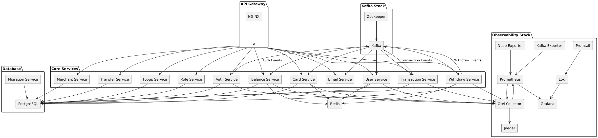

### Kubernetes

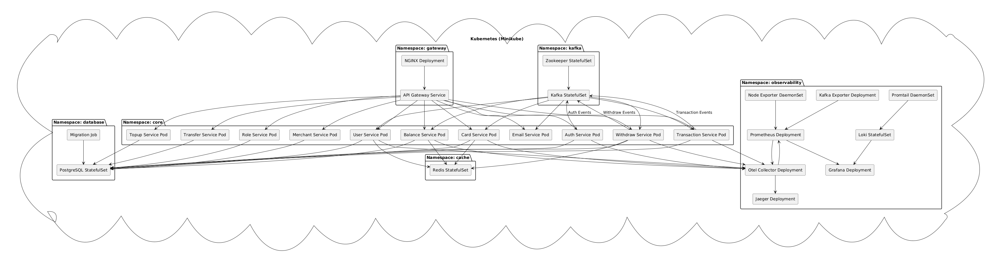

---

## Database Schema Overview

This schema represents the database design for a **Digital Payment Platform** supporting user management, cards, merchants, transactions, and authentication tokens.

## Entities and Relationships

### Users

- **Table:** `users`
- Stores user personal data such as first name, last name, email, password, verification code, and timestamps.
- Relationships:
  - One user can have multiple **cards**.
  - One user can register multiple **merchants**.
  - One user can have one **reset token** and many **refresh tokens**.
  - One user can have many **roles** via the `user_roles` table.

### Reset Tokens

- **Table:** `reset_tokens`
- Stores tokens used for password resets linked to users.
- One-to-one relationship with `users`.

### Cards

- **Table:** `cards`
- Represents payment cards owned by users.
- Each card has details like card number, type, expiration date, CVV, and provider.

### Merchants

- **Table:** `merchants`
- Registered businesses associated with users.
- Each merchant has a unique API key and a status (`pending`, `approved`, etc.).

### Merchant Documents

- **Table:** `merchant_documents`
- Stores uploaded verification documents for merchants.
- Linked to merchants via `merchant_id`.

### Saldos (Balances)

- **Table:** `saldos`
- Contains card balance and withdrawal information linked to cards.

### Transactions

- **Table:** `transactions`
- Logs transactions made with cards at merchants.
- Includes amount, payment method, status, and timestamps.

### Transfers

- **Table:** `transfers`
- Records transfers between two cards, including amount and status.

### Topups

- **Table:** `topups`
- Tracks top-up activities for cards.

### Withdraws

- **Table:** `withdraws`
- Records withdrawal activities from cards.

### Roles

- **Table:** `roles`
- Stores different user roles such as `admin`, `merchant`, or `customer`.

### User Roles

- **Table:** `user_roles`
- Connects users and roles in a many-to-many relationship.

### Refresh Tokens

- **Table:** `refresh_tokens`
- Manages JWT refresh tokens for user sessions.

---

## Relationships Summary

- `users` 1 — N `cards`
- `users` 1 — N `merchants`
- `users` 1 — 1 `reset_tokens`
- `users` 1 — N `refresh_tokens`
- `users` M — N `roles` via `user_roles`
- `merchants` 1 — N `merchant_documents`
- `cards` 1 — 1 `saldos`
- `cards` 1 — N `transactions`, `topups`, `transfers`, `withdraws`
- `merchants` 1 — N `transactions`


---

## Service

### ApiGateway

The API Gateway acts as a single entry point for all client requests, simplifying interactions with various microservices such as `AuthService`, `UserService`, `TransactionService`, and others. Using a framework like Echo, the API Gateway handles several important aspects:

- **Request Routing**: Forwards HTTP requests from clients to the appropriate microservice via gRPC.
- **Security**: Manages authentication and authorization, including JWT token validation.
- **Data Transformation**: Adjusts request and response formats as needed between clients and microservices.


### 🔄 Request Flow Through the API Gateway

Here's a general flow of a client request through the API Gateway:

1. **Client Sends a Request**: An HTTP request is made to the API Gateway.
2. **Validation & Security**: The gateway validates the request, including authentication and authorization.
3. **Routing to Microservice**: The request is forwarded to the appropriate microservice via gRPC.
5. **Response to Client**: The gateway sends the microservice's response back to the client.


----


### Auth Service

`AuthService` is a microservice responsible for **user authentication** and **account management**. It handles core features such as registration, login, password reset, identity verification, and token refreshing. Communication is done via **gRPC**, and email-related events are sent using **Kafka** to an external `email-service`.

---


### 🔄 Service Architecture

The AuthService is organized into multiple specialized service interfaces to separate concerns and improve maintainability:

- **RegistrationService:** Handles user registration and creation of new accounts.
- **LoginService:** Responsible for authenticating users and issuing JWT tokens.
- **PasswordResetService:** Manages the password reset flow, including sending OTP codes, verifying them, and resetting passwords.
- **IdentifyService:** Deals with token refreshing and retrieving information about the authenticated user.

All services integrate with:

- **Kafka** for publishing events like registration confirmations and OTP emails to the email-service.
- **Prometheus metrics** to track request counts and durations for observability.
- **OpenTelemetry tracing** to provide distributed tracing for requests, helping with debugging and performance tuning.
- **Structured logging** with Zap for detailed error and operational logs.


---


### 📌 Available RPC Methods

| Method | Description |
|--------|-------------|
| `RegisterUser` | Registers a new user into the system. |
| `LoginUser` | Authenticates a user and returns a token. |
| `RefreshToken` | Refreshes an access token without re-login. |
| `GetMe` | Returns information about the currently authenticated user. |
| `ForgotPassword` | Sends a verification code (OTP) to the user's email via Kafka. |
| `VerifyCode` | Verifies the OTP sent to the user's email. |
| `ResetPassword` | Resets the user's password after successful code verification. |

---

### 🔄 Password Reset Flow
```plaintext
@startuml
actor User

participant AuthService
participant "Kafka Topic:\nemail-service-topic-auth-forgot-password" as KafkaForgotPassword
participant EmailService
participant "Consumer Group:\nemail-service-group" as EmailConsumerGroup

User -> AuthService : ForgotPassword(email)
AuthService -> KafkaForgotPassword : Produce OTP Event
KafkaForgotPassword -> EmailConsumerGroup : Consume Event
EmailConsumerGroup -> EmailService : Process Email
EmailService -> User : Send OTP via Email

User -> AuthService : VerifyCode(code)
AuthService -> User : Code Verified

User -> AuthService : ResetPassword(new password)
AuthService -> User : Password Successfully Updated
@enduml
```
---

### 📊 Monitoring & Observability

#### Prometheus Metrics

Each RPC method is instrumented with:
- **Request Counter**: total number of requests by method and status.
- **Request Duration Histogram**: duration of each RPC method execution.

**Metric examples**:
- `identity_service_requests_total`
- `identity_service_request_duration_seconds`
- `login_service_requests_total`
- `login_service_request_duration_seconds`
- `register_service_requests_total`
- `register_service_request_duration_seconds`
- `password_reset_service_requests_total`
- `password_reset_service_request_duration_seconds`

#### 🔍 Tracing with OpenTelemetry

Each service is assigned a tracer for distributed tracing:
- `identity-service`
- `login-service`
- `register-service`
- `password-reset-service`

---

### 📬 Kafka Integration
The `AuthService` uses Kafka to publish email-related events. These messages are consumed by the `email-service`, which handles the actual sending of emails such as verification codes (OTP) or welcome messages.

| Kafka Topic                                | Purpose                                      | Consumer Group       |
|--------------------------------------------|----------------------------------------------|----------------------|
| `email-service-topic-auth-register`        | Send email notification after user registers | `email-service-group` |
| `email-service-topic-auth-forgot-password` | Send OTP for password reset                  | `email-service-group` |

-----


### User Service
`UserService` is a microservice responsible for **user account management** including creation, updates, soft deletion, restoration, and permanent deletion. It also supports user queries based on active or trashed status.

Communication is done via **gRPC**, and observability is built-in through **Prometheus metrics**, **OpenTelemetry tracing**, and structured logging using **Zap**.

---


### 🔄 Service Architecture

The `UserService` is split into two primary services for separation of concerns and scalability:

- **userCommandService**
  Handles all **write** operations such as `Create`, `Update`, `TrashedUser`, `RestoreUser`, and `DeleteUserPermanent`.

- **userQueryService**
  Handles all **read** operations such as `FindAll`, `FindById`, `FindByActive`, and `FindByTrashed`.

All services integrate with:
- **Prometheus metrics** to track request counts and durations for observability.
- **OpenTelemetry tracing** to provide distributed tracing for requests, helping with debugging and performance tuning.
- **Structured logging** with Zap for detailed error and operational logs.


### 📌 Available RPC Methods

#### 📘 Query Service Methods

| Method          | Description                                  |
| --------------- | -------------------------------------------- |
| `FindAll`       | Fetches all users with pagination.           |
| `FindById`      | Retrieves a user by ID.                      |
| `FindByActive`  | Retrieves users that are currently active.   |
| `FindByTrashed` | Retrieves users that have been soft-deleted. |

#### ✏️ Command Service Methods

| Method                   | Description                                 |
| ------------------------ | ------------------------------------------- |
| `Create`                 | Creates a new user.                         |
| `Update`                 | Updates user information.                   |
| `TrashedUser`            | Soft-deletes a user.                        |
| `RestoreUser`            | Restores a soft-deleted user.               |
| `DeleteUserPermanent`    | Permanently deletes a user from the system. |
| `RestoreAllUser`         | Restores all soft-deleted users.            |
| `DeleteAllUserPermanent` | Permanently deletes all soft-deleted users. |


---

### 📊 Monitoring & Observability

#### Prometheus Metrics

Each RPC method is instrumented with:

- **Request Counter**: total number of requests by method and status.
- **Request Duration Histogram**: duration of each RPC method execution.

**Metric examples**:
- `user_query_service_request_total`
- `user_query_service_request_duration_seconds`
- `user_command_service_requests_total`
- `user_command_service_request_duration_seconds`

---

#### 🔍 Tracing with OpenTelemetry

Each service is assigned a tracer for distributed tracing:
- `user-command-service`
- `user-query-service`


----

### Role Service
`RoleService` is a microservice responsible for managing **user roles** and **role-related operations** within the system. It supports essential functionalities such as role creation, updating, soft deletion (trashed), restoration, and permanent deletion. The service provides both command and query RPC methods to handle data modifications and retrieval efficiently. Communication happens over **gRPC**.


### 🔄 Service Architecture

The RoleService separates command and query responsibilities into two dedicated service components for better scalability and maintainability:

- **roleCommandService:** Handles all write operations such as create, update, trash, restore, and delete.
- **roleQueryService:** Handles read operations including fetching roles by various criteria.

Both services integrate with:
- **Prometheus metrics** to monitor total request counts and request duration histograms for each RPC method.
- **OpenTelemetry tracing** to capture detailed traces for observability, performance tuning, and troubleshooting.
- **Structured logging** with Zap for capturing detailed logs and errors.

---

### 📌 Available RPC Methods

#### 📘 Query Service Methods

| Method          | Description                                 |
| --------------- | ------------------------------------------- |
| `FindAllRole`   | Retrieve all roles with pagination.         |
| `FindByIdRole`  | Get detailed information of a role by ID.   |
| `FindByActive`  | List all active roles (non-deleted).        |
| `FindByTrashed` | List all soft-deleted (trashed) roles.      |
| `FindByUserId`  | Retrieve roles assigned to a specific user. |

#### ✏️ Command Service Methods

| Method                   | Description                                |
| ------------------------ | ------------------------------------------ |
| `CreateRole`             | Create a new role.                         |
| `UpdateRole`             | Update an existing role.                   |
| `TrashedRole`            | Soft-delete (trash) a role.                |
| `RestoreRole`            | Restore a previously trashed role.         |
| `DeleteRolePermanent`    | Permanently delete a role from the system. |
| `RestoreAllRole`         | Restore all trashed roles.                 |
| `DeleteAllRolePermanent` | Permanently delete all trashed roles.      |
---

---

### 📊 Monitoring with Prometheus

Each RPC method is instrumented with:

- **Request Counter**: total number of requests by method and status.
- **Request Duration Histogram**: duration of each RPC method execution.

**Metric examples**:
- `role_query_service_request_total`
- `role_query_service_request_duration_seconds`
- `role_command_service_requests_total`
- `role_command_service_request_duration_seconds`

### 🔍 Tracing with OpenTelemetry

Each service is assigned a tracer for distributed tracing:
- `role-command-service`
- `role-query-service`

---


### Card Service

`CardService` is a microservice responsible for card management and balance tracking within the system. It supports a wide range of operations, including card creation, updates, deletions (soft and hard), as well as balance/statistics reporting based on various dimensions such as monthly, yearly, and card number specific views.

This service communicates via gRPC, tracks observability via Prometheus and OpenTelemetry, and integrates with Kafka to publish balance creation events to the saldo-service.


### 🔄 Service Architecture

`CardService` is split into several subservices for clean separation of concerns:

- **CommandService**: Handles create/update/delete and produces Kafka events.
- **QueryService**: Handles all data retrieval operations.
- **DashboardService**: Aggregates metrics for dashboards.
- **StatisticService**: Provides time-based and card-based statistics.

All services are instrumented with:
- **Kafka** to produce and consume balance creation events.
- **Prometheus metrics** to track request counts and durations for observability.
- **OpenTelemetry tracing** to provide distributed tracing for requests, helping with debugging and performance tuning.
- **Structured logging** with Zap for detailed error and operational logs.

----

### 📌 Available RPC Methods

#### 📘 Query Operations

| Method              | Description                               |
| ------------------- | ----------------------------------------- |
| `FindAllCard`       | Fetch all cards with pagination.          |
| `FindByIdCard`      | Fetch a card by its ID.                   |
| `FindByUserIdCard`  | Fetch cards belonging to a specific user. |
| `FindByActiveCard`  | Get all active cards.                     |
| `FindByTrashedCard` | Get soft-deleted cards.                   |
| `FindByCardNumber`  | Fetch a card using its card number.       |

#### ✏️ Command Service Methods

| Method                   | Description                                  |
| ------------------------ | -------------------------------------------- |
| `CreateCard`             | Create a new card and produce a Kafka event. |
| `UpdateCard`             | Update card details.                         |
| `TrashedCard`            | Soft-delete a card.                          |
| `RestoreCard`            | Restore a soft-deleted card.                 |
| `DeleteCardPermanent`    | Permanently delete a card.                   |
| `RestoreAllCard`         | Restore all soft-deleted cards.              |
| `DeleteAllCardPermanent` | Permanently delete all soft-deleted cards.   |

#### 📊 Statistics Service Methods

| Method                                                                                           | Description                                        |
| ------------------------------------------------------------------------------------------------ | -------------------------------------------------- |
| `FindMonthlyBalance` / `FindYearlyBalance`                                                       | Monthly/Yearly balance summaries.                  |
| `FindMonthlyTopupAmount` / `FindYearlyTopupAmount`                                               | Monthly/Yearly top-up stats.                       |
| `FindMonthlyWithdrawAmount` / `FindYearlyWithdrawAmount`                                         | Monthly/Yearly withdrawal stats.                   |
| `FindMonthlyTransactionAmount` / `FindYearlyTransactionAmount`                                   | Monthly/Yearly transaction stats.                  |
| `FindMonthlyTransferSenderAmount` / `FindYearlyTransferSenderAmount`                             | Monthly/Yearly transfer (sent).                    |
| `FindMonthlyTransferReceiverAmount` / `FindYearlyTransferReceiverAmount`                         | Monthly/Yearly transfer (received).                |
| `FindMonthlyBalanceByCardNumber` / `FindYearlyBalanceByCardNumber`                               | Balance stats filtered by card number.             |
| `FindMonthlyTopupAmountByCardNumber` / `FindYearlyTopupAmountByCardNumber`                       | Top-up stats filtered by card number.              |
| `FindMonthlyWithdrawAmountByCardNumber` / `FindYearlyWithdrawAmountByCardNumber`                 | Withdrawal stats filtered by card number.          |
| `FindMonthlyTransactionAmountByCardNumber` / `FindYearlyTransactionAmountByCardNumber`           | Transaction stats filtered by card number.         |
| `FindMonthlyTransferSenderAmountByCardNumber` / `FindYearlyTransferSenderAmountByCardNumber`     | Transfer (sent) stats filtered by card number.     |
| `FindMonthlyTransferReceiverAmountByCardNumber` / `FindYearlyTransferReceiverAmountByCardNumber` | Transfer (received) stats filtered by card number. |


#### 📊 Dashboard Service Methods

| Method                | Description                             |
| --------------------- | --------------------------------------- |
| `DashboardCard`       | Fetch dashboard overview for all cards. |
| `DashboardCardNumber` | Fetch dashboard data by card number.    |


---

### 📊 Monitoring & Observability

#### Prometheus Metrics

Each RPC method is instrumented with:
- **Request Counter**: total number of requests by method and status.
- **Request Duration Histogram**: duration of each RPC method execution.

**Metric examples**:
- `card_command_service_requests_total`
- `card_command_service_request_duration_seconds`
- `card_dashboard_request_count`
- `card_dashboard_request_duration_seconds`
- `card_query_service_requests_total`
- `card_query_service_request_duration_seconds`
- `card_statistic_service_requests_total`
- `card_statistic_service_request_duration_seconds`
- `card_statistic_bycard_service_requests_total`
- `card_statistic_bycard_service_request_duration_seconds`

#### 🔍 Tracing with OpenTelemetry

Each service is assigned a tracer for distributed tracing:
- `card-query-service`
- `card-command-service`
- `card-dashboard-service`
- `card-statistic-service`
- `card-statistic-bycard-service`

----

### 📬 Kafka Integration

When a card is created, CardService emits an event to the saldo-service-topic-create-saldo topic.

| Kafka Topic                        | Description                                              | Consumer Group        |
| ---------------------------------- | -------------------------------------------------------- | --------------------- |
| `saldo-service-topic-create-saldo` | Sent when a new card is created to trigger balance setup | `saldo-service-group` |


------

### Email Service

`EmailService` is a microservice designed to handle **asynchronous email delivery** triggered by events from other services via **Kafka**. It is responsible for processing events such as OTP codes, registration confirmations, transaction notifications, and merchant status updates, and then sending the corresponding emails via SMTP.


This service is event-driven, meaning it reacts to messages produced to specific Kafka topics, decoupling it from the services that generate those events.


### 📊 Monitoring & Observability

#### Prometheus Metrics
  - email_service_requests_total{method, status}
    → Total number of email requests by method and response status.
  - email_service_request_duration_seconds{method}
    → Histogram tracking how long each email sending process takes.

#### OpenTelemetry Tracing
Each service is assigned a tracer for distributed tracing:
- `email-service`


#### 📬 Kafka Topics

| Topic Name                                     | Purpose                                           |
|-----------------------------------------------|---------------------------------------------------|
| `email-service-topic-auth-register`           | Send welcome email after user registration        |
| `email-service-topic-auth-forgot-password`    | Send OTP code for password reset                  |
| `email-service-topic-saldo-create`            | Notify when new balance is created                |
| `email-service-topic-topup-create`            | Notify user of a successful top-up                |
| `email-service-topic-transfer-create`         | Notify user of successful transfer                |
| `email-service-topic-merchant-create`         | Notify merchant creation success                  |
| `email-service-topic-merchant-update-status`  | Notify merchant status updates                    |
| `email-service-topic-merchant-document-create`| Notify merchant document creation                 |
| `email-service-topic-merchant-document-update-status` | Notify document status updates            |


----

### 💰 Saldo Service

`SaldoService` is a microservice responsible for **balance management**, including balance retrieval, statistics, and soft-delete operations. It also listens to events such as **saldo creation** triggered by the Card Service. Communication is done via **gRPC**, and event consumption is done via **Kafka** from the `card-service`.

---


### 🔄 Service Architecture

`SaldoService` is divided into several specialized services:

- **Command Service**: Manages saldo creation, update, trashing, and deletion.
- **Query Service**: Handles saldo retrieval and lookup by filters or metadata.
- **Statistics Service**: Provides historical and aggregated balance statistics.

All services use:

- **Kafka** to consume saldo creation events from Card Service.
- **Prometheus** metrics for request counting and duration tracking.
- **OpenTelemetry Tracing** for distributed system observability.
- **Zap Logger** for structured and contextual logging.

---


### 📌 Available RPC Methods

### 📘 Query Service Methods

| Method             | Description                                          |
| ------------------ | ---------------------------------------------------- |
| `FindAllSaldo`     | Retrieves all saldo records with pagination.         |
| `FindByIdSaldo`    | Retrieves saldo by its unique ID.                    |
| `FindByCardNumber` | Retrieves saldo data by card number.                 |
| `FindByActive`     | Retrieves saldo records that are currently active.   |
| `FindByTrashed`    | Retrieves saldo records that have been soft-deleted. |


### ✏️ Command Service Methods
| Method                    | Description                                    |
| ------------------------- | ---------------------------------------------- |
| `CreateSaldo`             | Creates a new saldo record.                    |
| `UpdateSaldo`             | Updates an existing saldo record.              |
| `TrashedSaldo`            | Soft-deletes a saldo record.                   |
| `RestoreSaldo`            | Restores a previously soft-deleted saldo.      |
| `DeleteSaldoPermanent`    | Permanently deletes a saldo record.            |
| `RestoreAllSaldo`         | Restores all soft-deleted saldo records.       |
| `DeleteAllSaldoPermanent` | Permanently deletes all trashed saldo records. |


### 📊 Statistics Service
| Method                         | Description                                   |
| ------------------------------ | --------------------------------------------- |
| `FindMonthlyTotalSaldoBalance` | Returns total saldo balance grouped by month. |
| `FindYearTotalSaldoBalance`    | Returns total saldo balance for a year.       |
| `FindMonthlySaldoBalances`     | Returns saldo data for each month of a year.  |
| `FindYearlySaldoBalances`      | Returns saldo data grouped by year.           |


### 📨 Kafka Integration

`SaldoService` listens for saldo creation events from the Card Service. When a card is created, the Card Service sends an event to the following Kafka topic:

| Kafka Topic | Purpose | Consumer Group |
|-------------|---------|----------------|
| `saldo-service-topic-create-saldo` | Triggers saldo creation when a new card is issued | `saldo-service-group` |

---

### 📊 Monitoring & Observability

#### Prometheus Metrics

Each RPC method is instrumented with:

- **Request Counter**: Tracks total number of requests by method and status.
- **Request Duration Histogram**: Tracks execution duration for each RPC method.

**Sample Metrics**:
- `saldo_command_service_request_total`
- `saldo_command_service_request_duration_seconds`
- `saldo_query_service_request_total`
- `saldo_query_service_request_duration_seconds`
- `saldo_statistics_service_request_total`
- `saldo_statistics_service_request_duration_seconds`

---

#### 🔍 Tracing with OpenTelemetry
Each internal service is assigned a tracer:

- `saldo-command-service`
- `saldo-query-service`
- `saldo-statistics-service`

---


### ⚙️ Event-Driven Flow (Saldo Creation via Kafka)
```plaintext
@startuml
actor CardService

participant KafkaTopic as "Kafka Topic:\nsaldo-service-topic-create-saldo"
participant "Consumer Group:\nsaldo-service-group" as SaldoConsumerGroup
participant SaldoService

CardService -> KafkaTopic : Produce CreateSaldo Event
KafkaTopic -> SaldoConsumerGroup : Consume Event
SaldoConsumerGroup -> SaldoService : Handle CreateSaldo
SaldoService -> Database : Persist New Saldo
SaldoService -> Prometheus : Update Metrics
@enduml
```

------

### Merchant Service

The **Merchant Service** is a comprehensive microservice designed to manage merchant accounts, documents, transactions, and analytics within a payment processing ecosystem. It provides both query and command operations through a CQRS (Command Query Responsibility Segregation) pattern and integrates seamlessly with the Auth Service for authentication and authorization.


### 🔄 Service Architecture

The MerchantService is organized into multiple specialized service interfaces to separate responsibilities and improve scalability and maintainability:

  - **MerchantCommandService**
    Handles merchant lifecycle operations such as creation, update, soft delete, restore, and permanent deletion.
    Publishes domain events (e.g., email-service-topic-merchant-created, email-service-topic-merchant-update-status) to Kafka for asynchronous downstream processing.
    Also produces messages to Kafka topics consumed by the email-service-group to notify users when a merchant is approved or rejected.

  - **MerchantQueryService**
    Focuses on data retrieval operations for merchant entities, including paginated listings, filtering (e.g., by status), and fetching individual merchant details. Optimized for performance and scalability.

  - **MerchantDocumentCommandService**
    Manages merchant document operations such as uploading, updating, soft deleting, restoring, and permanently deleting documents.
    Publishes domain events (e.g., email-service-topic-merchant-documents-created, email-service-topic-merchant-documents-update-status) to Kafka, including events consumed by the email-service-group to notify users of document approval status.

  - **MerchantDocumentQueryService**
    Handles retrieval of merchant documents, supports filtering by status (active/trashed), and provides document metadata such as file type, upload date, and current status.

  - **MerchantTransactionService**
    Provides access to merchant-related transaction history and supports querying, filtering, and analytics related to transaction flow and grouping.

  - **MerchantStatisticsService**
    Composed of multiple services responsible for delivering analytics and statistics:
      - **MerchantStatisService**: General analytics across all merchants.
      - **MerchantStatisByApiKeyService**: Metrics and insights scoped by API key.
      - **MerchantStatisByMerchantService**: Analytics scoped per individual merchant entity.

All services are tightly integrated with:
  - **Kafka** — Used for producing and consuming domain events such as email-service-topic-merchant-created, email-service-topic-merchant-update-status, email-service-topic-merchant-documents-created, email-service-topic-merchant-documents-update-status, and others.
    Key Kafka topics are consumed by systems like email-service-group to drive asynchronous workflows, including email notifications for merchant and document approvals.

  - **Prometheus metrics** — Integrated across all gRPC endpoints to track request counts, durations, and error rates, enabling system observability.

  - **OpenTelemetry tracing** — Provides end-to-end distributed tracing across services and infrastructure, allowing fine-grained visibility for debugging and performance optimization.

  - **Structured logging with Zap** — Consistent and structured log outputs across all services to support effective monitoring and operational insights.


## 📌 Available RPC Methods

### MerchantService RPCs

#### Query Operations
| Method | Description | Request Type | Response Type |
|--------|-------------|--------------|---------------|
| `FindAllMerchant` | Retrieve all merchants with pagination | `FindAllMerchantRequest` | `ApiResponsePaginationMerchant` |
| `FindByIdMerchant` | Find merchant by ID | `FindByIdMerchantRequest` | `ApiResponseMerchant` |
| `FindByApiKey` | Find merchant by API key | `FindByApiKeyRequest` | `ApiResponseMerchant` |
| `FindByMerchantUserId` | Find merchants by user ID | `FindByMerchantUserIdRequest` | `ApiResponsesMerchant` |
| `FindByActive` | Get active merchants only | `FindAllMerchantRequest` | `ApiResponsePaginationMerchantDeleteAt` |
| `FindByTrashed` | Get soft-deleted merchants | `FindAllMerchantRequest` | `ApiResponsePaginationMerchantDeleteAt` |

#### Command Operations
| Method | Description | Request Type | Response Type |
|--------|-------------|--------------|---------------|
| `CreateMerchant` | Create new merchant account | `CreateMerchantRequest` | `ApiResponseMerchant` |
| `UpdateMerchant` | Update merchant information | `UpdateMerchantRequest` | `ApiResponseMerchant` |
| `UpdateMerchantStatus` | Update merchant status | `UpdateMerchantStatusRequest` | `ApiResponseMerchant` |
| `TrashedMerchant` | Soft delete merchant | `FindByIdMerchantRequest` | `ApiResponseMerchant` |
| `RestoreMerchant` | Restore soft-deleted merchant | `FindByIdMerchantRequest` | `ApiResponseMerchant` |
| `DeleteMerchantPermanent` | Permanently delete merchant | `FindByIdMerchantRequest` | `ApiResponseMerchantDelete` |
| `RestoreAllMerchant` | Restore all soft-deleted merchants | `google.protobuf.Empty` | `ApiResponseMerchantAll` |
| `DeleteAllMerchantPermanent` | Permanently delete all merchants | `google.protobuf.Empty` | `ApiResponseMerchantAll` |

#### Transaction Analytics
| Method | Description | Request Type | Response Type |
|--------|-------------|--------------|---------------|
| `FindAllTransactionMerchant` | Get all merchant transactions | `FindAllMerchantRequest` | `ApiResponsePaginationMerchantTransaction` |
| `FindAllTransactionByMerchant` | Get transactions for specific merchant | `FindAllMerchantTransaction` | `ApiResponsePaginationMerchantTransaction` |
| `FindAllTransactionByApikey` | Get transactions by API key | `FindAllMerchantApikey` | `ApiResponsePaginationMerchantTransaction` |

#### Payment Method Analytics
| Method | Description | Request Type | Response Type |
|--------|-------------|--------------|---------------|
| `FindMonthlyPaymentMethodsMerchant` | Monthly payment method statistics | `FindYearMerchant` | `ApiResponseMerchantMonthlyPaymentMethod` |
| `FindYearlyPaymentMethodMerchant` | Yearly payment method statistics | `FindYearMerchant` | `ApiResponseMerchantYearlyPaymentMethod` |
| `FindMonthlyPaymentMethodByMerchants` | Monthly stats by merchant ID | `FindYearMerchantById` | `ApiResponseMerchantMonthlyPaymentMethod` |
| `FindYearlyPaymentMethodByMerchants` | Yearly stats by merchant ID | `FindYearMerchantById` | `ApiResponseMerchantYearlyPaymentMethod` |
| `FindMonthlyPaymentMethodByApikey` | Monthly stats by API key | `FindYearMerchantByApikey` | `ApiResponseMerchantMonthlyPaymentMethod` |
| `FindYearlyPaymentMethodByApikey` | Yearly stats by API key | `FindYearMerchantByApikey` | `ApiResponseMerchantYearlyPaymentMethod` |

#### Amount Analytics
| Method | Description | Request Type | Response Type |
|--------|-------------|--------------|---------------|
| `FindMonthlyAmountMerchant` | Monthly amount statistics | `FindYearMerchant` | `ApiResponseMerchantMonthlyAmount` |
| `FindYearlyAmountMerchant` | Yearly amount statistics | `FindYearMerchant` | `ApiResponseMerchantYearlyAmount` |
| `FindMonthlyTotalAmountMerchant` | Monthly total amount | `FindYearMerchant` | `ApiResponseMerchantMonthlyTotalAmount` |
| `FindYearlyTotalAmountMerchant` | Yearly total amount | `FindYearMerchant` | `ApiResponseMerchantYearlyTotalAmount` |

### MerchantDocumentService RPCs

#### Query Operations
| Method | Description | Request Type | Response Type |
|--------|-------------|--------------|---------------|
| `FindAll` | Get all merchant documents | `FindAllMerchantDocumentsRequest` | `ApiResponsePaginationMerchantDocument` |
| `FindAllActive` | Get active documents only | `FindAllMerchantDocumentsRequest` | `ApiResponsePaginationMerchantDocument` |
| `FindAllTrashed` | Get soft-deleted documents | `FindAllMerchantDocumentsRequest` | `ApiResponsePaginationMerchantDocumentAt` |
| `FindById` | Find document by ID | `FindMerchantDocumentByIdRequest` | `ApiResponseMerchantDocument` |

#### Command Operations
| Method | Description | Request Type | Response Type |
|--------|-------------|--------------|---------------|
| `Create` | Upload new merchant document | `CreateMerchantDocumentRequest` | `ApiResponseMerchantDocument` |
| `Update` | Update document information | `UpdateMerchantDocumentRequest` | `ApiResponseMerchantDocument` |
| `UpdateStatus` | Update document status | `UpdateMerchantDocumentStatusRequest` | `ApiResponseMerchantDocument` |
| `Trashed` | Soft delete document | `TrashedMerchantDocumentRequest` | `ApiResponseMerchantDocument` |
| `Restore` | Restore soft-deleted document | `RestoreMerchantDocumentRequest` | `ApiResponseMerchantDocument` |
| `DeletePermanent` | Permanently delete document | `DeleteMerchantDocumentPermanentRequest` | `ApiResponseMerchantDocumentDelete` |
| `RestoreAll` | Restore all soft-deleted documents | `google.protobuf.Empty` | `ApiResponseMerchantDocumentAll` |
| `DeleteAllPermanent` | Permanently delete all documents | `google.protobuf.Empty` | `ApiResponseMerchantDocumentAll` |


### 📊 Monitoring & Observability

#### Prometheus Metrics

Each service component exposes standardized metrics:

#### Request Metrics
- **Counter**: `{service_name}_requests_total` (labels: method, status)
- **Histogram**: `{service_name}_request_duration_seconds` (labels: method)

#### Service-Specific Metrics
- `merchant_command_service_requests_total`
- `merchant_command_service_request_duration_seconds`
- `merchant_query_service_requests_total`
- `merchant_query_service_request_duration_seconds`
- `merchant_document_command_request_count`
- `merchant_document_command_request_duration_seconds`
- `merchant_document_query_request_count`
- `merchant_document_query_request_duration_seconds`
- `merchant_transaction_service_requests_total`
- `merchant_transaction_service_request_duration_seconds`
- `merchant_statistic_service_request_total`
- `merchant_statistic_service_request_duration_seconds`
- `merchant_statis_by_apikey_service_requests_total`
- `merchant_statis_by_apikey_service_request_duration_seconds`
- `merchant_statis_by_merchant_service_requests_total`
- `merchant_statis_by_merchant_service_request_duration_seconds`

#### 🔍 Tracing with OpenTelemetry

Distributed tracing is implemented with dedicated tracers:
- `merchant-command-service`
- `merchant-query-service`
- `merchant-document-command-service`
- `merchant-document-query-service`
- `merchant-transaction-service`
- `merchant-statistic-service`
- `merchant-statis-by-apikey-service`
- `merchant-statis-by-merchant-service`

----

### 📬 Kafka Integration

The MerchantService uses Kafka to publish domain events related to merchant and document lifecycle operations. These messages are consumed by the email-service, which is responsible for sending out email notifications—such as merchant approval, document status updates, or creation confirmations.

| Kafka Topic                                            | Purpose                                                               | Consumer Group        |
| ------------------------------------------------------ | --------------------------------------------------------------------- | --------------------- |
| `email-service-topic-merchant-created`                 | Notify user when a new merchant is successfully created               | `email-service-group` |
| `email-service-topic-merchant-update-status`           | Notify user when merchant status is updated (e.g., approved)          | `email-service-group` |
| `email-service-topic-merchant-documents-created`       | Notify user when a merchant document is uploaded                      | `email-service-group` |
| `email-service-topic-merchant-documents-update-status` | Notify user when document status is updated (e.g., approved/rejected) | `email-service-group` |


### Topup Service

`TopupService` is a microservice responsible for handling balance top-ups. It supports monthly and yearly statistics based on method, amount, status, and card number. This service is built with strong observability using Prometheus, OpenTelemetry, and Zap Logger.


### 🔄 Service Architecture

TopupService is separated into several components for scalability and responsibility separation:
  - **topupCommandService**
    Handles write operations such as CreateTopup, UpdateTopup, TrashedTopup, RestoreTopup, and DeleteTopupPermanent.
  - **topupQueryService**
    Handles read operations such as FindAllTopup, FindByIdTopup, FindByCardNumberTopup, and top-up statistics.
  - **topupStatisticByCardService**
    Provides top-up statistic reports based on card number.
  - **topupStatisticService**
    Provides general top-up statistics (for all cards).

----

### 📌 Available RPC Methods

#### 📘 Query Service Methods

| Method                                      | Description                                              |
| ------------------------------------------- | -------------------------------------------------------- |
| `FindAllTopup`                              | Retrieve all top-up data with pagination.                |
| `FindAllTopupByCardNumber`                  | Retrieve all top-up data filtered by card number.        |
| `FindByIdTopup`                             | Get top-up details by ID.                                |
| `FindByCardNumberTopup`                     | Get top-up details by card number.                       |
| `FindByActive`                              | Get all active (non-deleted) top-up records.             |
| `FindByTrashed`                             | Get all soft-deleted top-up records.                     |
| `FindMonthlyTopupStatusSuccess`             | Monthly statistics of successful top-ups for all cards.  |
| `FindYearlyTopupStatusSuccess`              | Yearly statistics of successful top-ups for all cards.   |
| `FindMonthlyTopupStatusFailed`              | Monthly statistics of failed top-ups for all cards.      |
| `FindYearlyTopupStatusFailed`               | Yearly statistics of failed top-ups for all cards.       |
| `FindMonthlyTopupStatusSuccessByCardNumber` | Monthly statistics of successful top-ups by card number. |
| `FindYearlyTopupStatusSuccessByCardNumber`  | Yearly statistics of successful top-ups by card number.  |
| `FindMonthlyTopupStatusFailedByCardNumber`  | Monthly statistics of failed top-ups by card number.     |
| `FindYearlyTopupStatusFailedByCardNumber`   | Yearly statistics of failed top-ups by card number.      |
| `FindMonthlyTopupMethods`                   | Monthly statistics of top-up methods for all cards.      |
| `FindYearlyTopupMethods`                    | Yearly statistics of top-up methods for all cards.       |
| `FindMonthlyTopupAmounts`                   | Monthly statistics of top-up amounts for all cards.      |
| `FindYearlyTopupAmounts`                    | Yearly statistics of top-up amounts for all cards.       |
| `FindMonthlyTopupMethodsByCardNumber`       | Monthly statistics of top-up methods by card number.     |
| `FindYearlyTopupMethodsByCardNumber`        | Yearly statistics of top-up methods by card number.      |
| `FindMonthlyTopupAmountsByCardNumber`       | Monthly statistics of top-up amounts by card number.     |
| `FindYearlyTopupAmountsByCardNumber`        | Yearly statistics of top-up amounts by card number.      |

#### ✏️ Command Service Methods

| Method                    | Description                                         |
| ------------------------- | --------------------------------------------------- |
| `CreateTopup`             | Create a new top-up record.                         |
| `UpdateTopup`             | Update an existing top-up record.                   |
| `TrashedTopup`            | Soft-delete a top-up record.                        |
| `RestoreTopup`            | Restore a soft-deleted top-up record.               |
| `DeleteTopupPermanent`    | Permanently delete a top-up record.                 |
| `RestoreAllTopup`         | Restore all soft-deleted top-up records.            |
| `DeleteAllTopupPermanent` | Permanently delete all soft-deleted top-up records. |


### 📊 Monitoring & Observability

#### 📈 Prometheus Metrics

Each RPC method includes:
  - **Request Counter**: Total number of requests, labeled by method and status.
  - **Request Duration Histogram**: Measures execution time for each method.

Metric examples:
  - `topup_query_service_request_total`
  - `topup_query_service_request_duration_seconds`
  - `topup_command_service_request_total`
  - `topup_command_service_request_duration_seconds`
  - `topup_statistic_service_request_total`
  - `topup_statistic_service_request_duration_seconds`
  - `topup_statistic_by_card_service_request_total`
  - `topup_statistic_by_card_service_request_duration_seconds`


#### 🔍 OpenTelemetry Tracing

Each service is instrumented with a dedicated tracer:
  - `topup-command-service`
  - `topup-query-service`
  - `topup-statistic-service`
  - `topup-statistic-by-card-service`

----


### 📬 Kafka Integration

The TopupService integrates with Kafka to publish domain events related to top-up transactions. One such event is the top-up creation, which triggers downstream processes like email notifications.

These messages are published to specific Kafka topics and consumed by the email-service, which is responsible for sending out transactional emails such as successful top-up confirmations.

| Kafka Topic                                            | Purpose                                                               | Consumer Group        |
| ------------------------------------------------------ | --------------------------------------------------------------------- | --------------------- |
| `email-service-topic-topup-created`                 | Notify user when a new topup is successfully created               | `email-service-group` |


### Transaction Service

``TransactionService`` is a microservice responsible for managing balance top-up transactions. It supports monthly and yearly statistics based on method, amount, status, and card number. This service is built with strong observability using Prometheus, OpenTelemetry, and Zap Logger.


### 🔄 Service Architecture
`TransactionService` is divided into multiple components to ensure scalability and clear separation of concerns:
  - **transactionCommandService**
    Handles write operations: CreateTransaction, UpdateTransaction, TrashedTransaction, RestoreTransaction, and DeleteTransactionPermanent.
  - **transactionQueryService**
    Handles read operations: FindAllTransaction, FindByIdTransaction, FindByCardNumberTransaction, and statistical queries.
  - **transactionStatisticService**
    Provides general transaction statistics for all cards.
  - **transactionStatisticByCardService**
    Provides transaction statistics grouped by card number.


### 📌 Available RPC Methods

#### 📘 Query Service Methods
| Method                           | Description                                    |
| -------------------------------- | ---------------------------------------------- |
| `FindAllTransaction`             | Retrieve all transactions with pagination.     |
| `FindAllTransactionByCardNumber` | Retrieve transactions filtered by card number. |
| `FindByIdTransaction`            | Get transaction details by ID.                 |
| `FindByCardNumberTransaction`    | Get transaction details by card number.        |
| `FindByActive`                   | Get all active (non-deleted) transactions.     |
| `FindByTrashed`                  | Get all soft-deleted transactions.             |


#### 📊 Statistics Service Methods

| Method                                | Description                                                |
| ------------------------------------- | ---------------------------------------------------------- |
| `FindMonthlyTransactionStatusSuccess` | Monthly statistics of successful transactions (all cards). |
| `FindYearlyTransactionStatusSuccess`  | Yearly statistics of successful transactions (all cards).  |
| `FindMonthlyTransactionStatusFailed`  | Monthly statistics of failed transactions (all cards).     |
| `FindYearlyTransactionStatusFailed`   | Yearly statistics of failed transactions (all cards).      |
| `FindMonthlyTransactionStatusSuccessByCardNumber` | Monthly successful transactions by card number. |
| `FindYearlyTransactionStatusSuccessByCardNumber`  | Yearly successful transactions by card number.  |
| `FindMonthlyTransactionStatusFailedByCardNumber`  | Monthly failed transactions by card number.     |
| `FindYearlyTransactionStatusFailedByCardNumber`   | Yearly failed transactions by card number.      |
| `FindMonthlyTransactionMethods`             | Monthly transaction method statistics (all cards). |
| `FindYearlyTransactionMethods`              | Yearly transaction method statistics (all cards).  |
| `FindMonthlyTransactionMethodsByCardNumber` | Monthly method stats by card number.               |
| `FindYearlyTransactionMethodsByCardNumber`  | Yearly method stats by card number.                |
| `FindMonthlyTransactionAmounts`             | Monthly transaction amount stats (all cards). |
| `FindYearlyTransactionAmounts`              | Yearly transaction amount stats (all cards).  |
| `FindMonthlyTransactionAmountsByCardNumber` | Monthly amount stats by card number.          |
| `FindYearlyTransactionAmountsByCardNumber`  | Yearly amount stats by card number.           |

#### 📝 Command Service Methods

| Method                          | Description                                       |
| ------------------------------- | ------------------------------------------------- |
| `CreateTransaction`             | Create a new transaction record.                  |
| `UpdateTransaction`             | Update an existing transaction record.            |
| `TrashedTransaction`            | Soft-delete a transaction record.                 |
| `RestoreTransaction`            | Restore a soft-deleted transaction.               |
| `DeleteTransactionPermanent`    | Permanently delete a transaction.                 |
| `RestoreAllTransaction`         | Restore all soft-deleted transactions.            |
| `DeleteAllTransactionPermanent` | Permanently delete all soft-deleted transactions. |

### 📊 Monitoring & Observability

#### 📈 Prometheus Metrics

Each service exposes the following metrics:
  - **Request Counter**: Total number of requests, labeled by method and status.
  - **Request Duration Histogram**: Measures execution time for each method.

Metric examples:
  - `transaction_query_service_request_total`
  - `transaction_query_service_request_duration_seconds`
  - `transaction_command_service_request_total`
  - `transaction_command_service_request_duration_seconds`
  - `transaction_statistic_service_request_total`
  - `transaction_statistic_service_request_duration_seconds`
  - `transaction_statistic_by_card_service_request_total`
  - `transaction_statistic_by_card_service_request_duration_seconds`

#### 🔍 OpenTelemetry Tracing

All services are instrumented with their own tracer:
  - `transaction-command-service`
  - `transaction-query-service`
  - `transaction-statistic-service`
  - `transaction-statistic-by-card-service`


### 📬 Kafka Integration

TransactionService publishes events related to transaction lifecycle (e.g., creation) to Kafka topics. These are consumed by the email-service to send out notification emails.

| Kafka Topic                               | Purpose                                                | Consumer Group        |
| ----------------------------------------- | ------------------------------------------------------ | --------------------- |
| `email-service-topic-transaction-created` | Notify users when a transaction (t is successful | `email-service-group` |


### Transfer Service
`TransferService` is a microservice responsible for managing card-to-card transfer transactions. It supports monthly and yearly statistics based on method, amount, status, and card numbers (sender/receiver). This service is built with strong observability using Prometheus, OpenTelemetry, and Zap Logger.


### 🔄 Service Architecture

TransferService is divided into multiple components to ensure scalability and clear separation of concerns:
  - **transferCommandService**
    Handles write operations such as CreateTransfer, UpdateTransfer, TrashedTransfer, RestoreTransfer, and DeleteTransferPermanent.
  - **transferQueryService**
    Handles read operations such as FindAllTransfer, FindByIdTransfer, FindTransferByTransferFrom, FindTransferByTransferTo, and soft-deletion filters.
  - **transferStatisticService**
    Provides general transfer statistics for all cards.
  - **transferStatisticByCardService**
    Provides transfer statistics grouped by sender and receiver card numbers.

----

### 📌 Available RPC Methods

#### 📘 Query Service Methods
| Method                       | Description                                               |
| ---------------------------- | --------------------------------------------------------- |
| `FindAllTransfer`            | Retrieve all transfer records with pagination.            |
| `FindByIdTransfer`           | Retrieve a specific transfer by ID.                       |
| `FindTransferByTransferFrom` | Retrieve transfers initiated from a specific card number. |
| `FindTransferByTransferTo`   | Retrieve transfers received by a specific card number.    |
| `FindByActiveTransfer`       | Get all active (non-deleted) transfers.                   |
| `FindByTrashedTransfer`      | Get all soft-deleted transfers.                           |


#### 📊 Statistics Service Methods
| Method                                           | Description                                           |
| ------------------------------------------------ | ----------------------------------------------------- |
| `FindMonthlyTransferStatusSuccess`               | Monthly success transfer stats for all cards.         |
| `FindYearlyTransferStatusSuccess`                | Yearly success transfer stats for all cards.          |
| `FindMonthlyTransferStatusFailed`                | Monthly failed transfer stats for all cards.          |
| `FindYearlyTransferStatusFailed`                 | Yearly failed transfer stats for all cards.           |
| `FindMonthlyTransferStatusSuccessByCardNumber`   | Monthly success stats by sender/receiver card number. |
| `FindYearlyTransferStatusSuccessByCardNumber`    | Yearly success stats by sender/receiver card number.  |
| `FindMonthlyTransferStatusFailedByCardNumber`    | Monthly failed stats by sender/receiver card number.  |
| `FindYearlyTransferStatusFailedByCardNumber`     | Yearly failed stats by sender/receiver card number.   |
| `FindMonthlyTransferAmounts`                     | Monthly aggregated transfer amounts (all cards).      |
| `FindYearlyTransferAmounts`                      | Yearly aggregated transfer amounts (all cards).       |
| `FindMonthlyTransferAmountsBySenderCardNumber`   | Monthly amount stats by sender card.                  |
| `FindMonthlyTransferAmountsByReceiverCardNumber` | Monthly amount stats by receiver card.                |
| `FindYearlyTransferAmountsBySenderCardNumber`    | Yearly amount stats by sender card.                   |
| `FindYearlyTransferAmountsByReceiverCardNumber`  | Yearly amount stats by receiver card.                 |


#### 📝 Command Service Methods
| Method                       | Description                                    |
| ---------------------------- | ---------------------------------------------- |
| `CreateTransfer`             | Create a new transfer record.                  |
| `UpdateTransfer`             | Update an existing transfer record.            |
| `TrashedTransfer`            | Soft-delete a transfer record.                 |
| `RestoreTransfer`            | Restore a soft-deleted transfer.               |
| `DeleteTransferPermanent`    | Permanently delete a transfer.                 |
| `RestoreAllTransfer`         | Restore all soft-deleted transfers.            |
| `DeleteAllTransferPermanent` | Permanently delete all soft-deleted transfers. |


----

### 📊 Monitoring & Observability

#### 📈 Prometheus Metrics

Each service exposes the following metrics:
  - **Request Counter**: Counts all requests per method and status.
  - **Request Duration** Histogram: Measures the latency for each method.

Metric examples:
  - `transfer_query_service_request_total`
  - `transfer_query_service_request_duration_seconds`
  - `transfer_command_service_request_total`
  - `transfer_command_service_request_duration_seconds`
  - `transfer_statistic_service_request_total`
  - `transfer_statistic_service_request_duration_seconds`
  - `transfer_statistic_by_card_service_request_total`
  - `transfer_statistic_by_card_service_request_duration_seconds`


#### 🔍 OpenTelemetry Tracing
All services are instrumented with their own tracer:
  - `transfer-command-service`
  - `transfer-query-service`
  - `transfer-statistic-service`
  - `transfer-statistic-by-card-service`


----

### 📬 Kafka Integration

`TransferService` publishes events related to transfer lifecycle (e.g., after successful transfer) to Kafka topics. These events are consumed by other services like the email-service to send notifications.

| Kafka Topic                            | Purpose                                               | Consumer Group        |
| -------------------------------------- | ----------------------------------------------------- | --------------------- |
| `email-service-topic-transfer-created` | Notify users when a transfer is successfully created. | `email-service-group` |


----

### Withdraw Service

`WithdrawService` is a microservice responsible for managing withdrawal transactions. It provides monthly and yearly statistics categorized by status, amount, and card number. The service is designed with high observability using Prometheus, OpenTelemetry, and Zap Logger.


### 🔄 Service Architecture

**WithdrawService** is structured into multiple specialized services:

- **`withdrawCommandService`** — Manages write operations such as create, update, soft-delete, restore, and permanent delete.
- **`withdrawQueryService`** — Handles read operations like listing, searching, and retrieving withdrawals.
- **`withdrawStatisticService`** — Provides general withdrawal statistics across all cards.
- **`withdrawStatisticByCardService`** — Provides withdrawal statistics grouped by card number.

-----

### 📌 Available RPC Methods

#### 📘 Query Service Methods

| Method                         | Description                                      |
|-------------------------------|--------------------------------------------------|
| `FindAllWithdraw`             | Retrieve all withdrawal records with pagination. |
| `FindAllWithdrawByCardNumber` | Retrieve withdrawals filtered by card number.    |
| `FindByIdWithdraw`            | Retrieve withdrawal by ID.                       |
| `FindByCardNumber`            | Retrieve withdrawals by card number.             |
| `FindByActive`                | Get all active (non-deleted) withdrawals.        |
| `FindByTrashed`               | Get all soft-deleted withdrawals.                |

---

#### 📊 Statistic Service Methods


| Method                            | Description                             |
|----------------------------------|-----------------------------------------|
| `FindMonthlyWithdrawStatusSuccess` | Monthly successful withdrawals.       |
| `FindYearlyWithdrawStatusSuccess`  | Yearly successful withdrawals.        |
| `FindMonthlyWithdrawStatusFailed`  | Monthly failed withdrawals.           |
| `FindYearlyWithdrawStatusFailed`   | Yearly failed withdrawals.            |
| `FindMonthlyWithdraws`             | Monthly withdrawal amounts.           |
| `FindYearlyWithdraws`              | Yearly withdrawal amounts.            |
| `FindMonthlyWithdrawStatusSuccessCardNumber` | Monthly successful withdrawals by card number.  |
| `FindYearlyWithdrawStatusSuccessCardNumber`  | Yearly successful withdrawals by card number.   |
| `FindMonthlyWithdrawStatusFailedCardNumber`  | Monthly failed withdrawals by card number.      |
| `FindYearlyWithdrawStatusFailedCardNumber`   | Yearly failed withdrawals by card number.       |
| `FindMonthlyWithdrawsByCardNumber`           | Monthly withdrawal amounts by card number.      |
| `FindYearlyWithdrawsByCardNumber`            | Yearly withdrawal amounts by card number.       |
| `CreateWithdraw`             | Create a new withdrawal record.                 |
| `UpdateWithdraw`             | Update an existing withdrawal.                  |
| `TrashedWithdraw`            | Soft-delete a withdrawal.                       |
| `RestoreWithdraw`            | Restore a soft-deleted withdrawal.              |
| `DeleteWithdrawPermanent`    | Permanently delete a withdrawal.                |
| `RestoreAllWithdraw`         | Restore all soft-deleted withdrawals.           |
| `DeleteAllWithdrawPermanent` | Permanently delete all soft-deleted withdrawals.|

---

## 📊 Monitoring & Observability

#### 📈 Prometheus Metrics

Each service exposes:

- **Request Counter** — Total requests, labeled by method and status.
- **Request Duration Histogram** — Duration metrics per method.

**Metric name examples:**
- `withdraw_command_service_request_total`
- `withdraw_command_service_request_duration_seconds`
- `withdraw_query_service_request_total`
- `withdraw_query_service_request_duration_seconds`
- `withdraw_statistic_service_request_total`
- `withdraw_statistic_service_request_duration_seconds`
- `withdraw_statistic_by_card_service_request_total`
- `withdraw_statistic_by_card_service_request_duration_seconds`


#### 🔍 OpenTelemetry Tracing

Each component uses a dedicated tracer for distributed tracing:

- `withdraw-command-service`
- `withdraw-query-service`
- `withdraw-statistic-service`
- `withdraw-statistic-by-card-service`

----


### 📬 Kafka Integration

The WithdrawService publishes withdrawal events to Kafka to enable asynchronous processing. These events trigger essential downstream operations like email notifications and transaction records.


| Kafka Topic                                            | Purpose                                                               | Consumer Group        |
| ------------------------------------------------------ | --------------------------------------------------------------------- | --------------------- |
| `email-service-topic-withdraw-created`                 | Notify user when a new withdraw is successfully created               | `email-service-group` |
----

## Screenshoot

### API Documentation
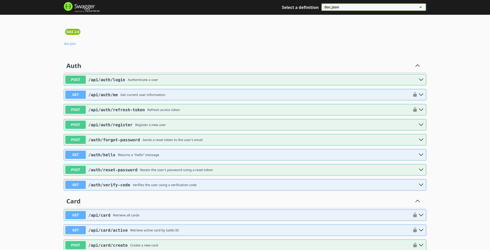


### ERD Documentation


### Grafana Dashboard(Prometheus & OpenTelemetry(Jaeger))

#### Node Exporter

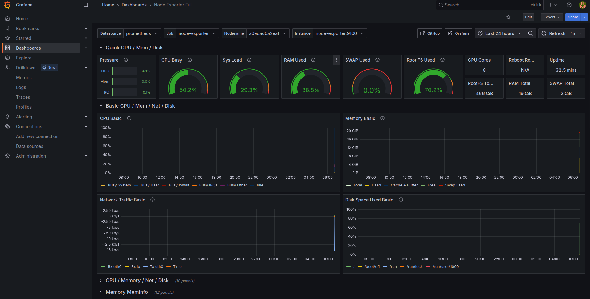

#### Email Service

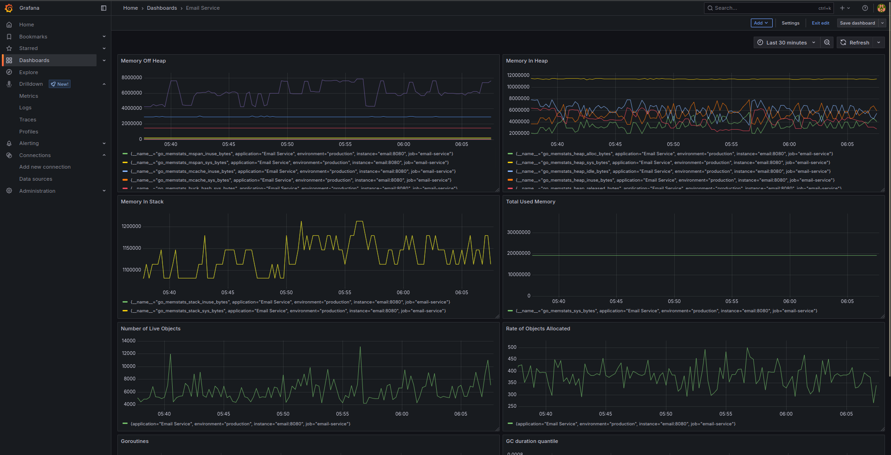


#### Auth Service

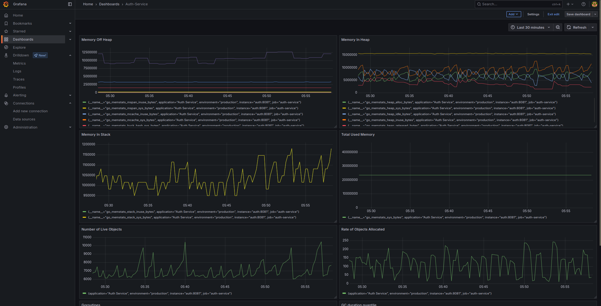

#### User Service

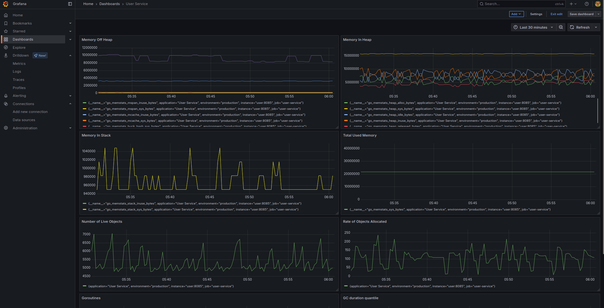


#### Role Service

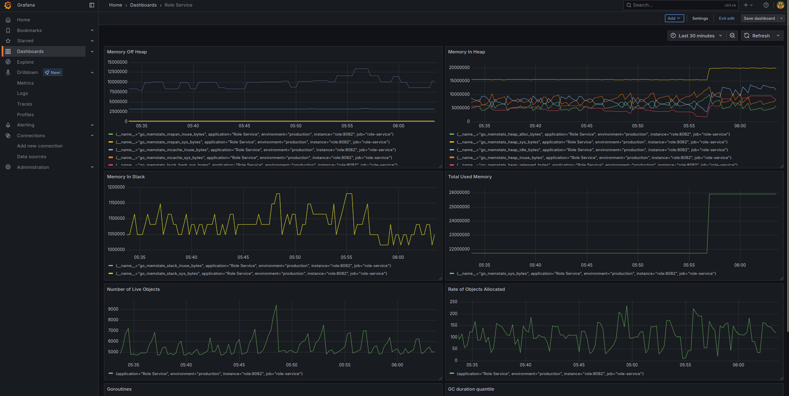


#### Merchant Service

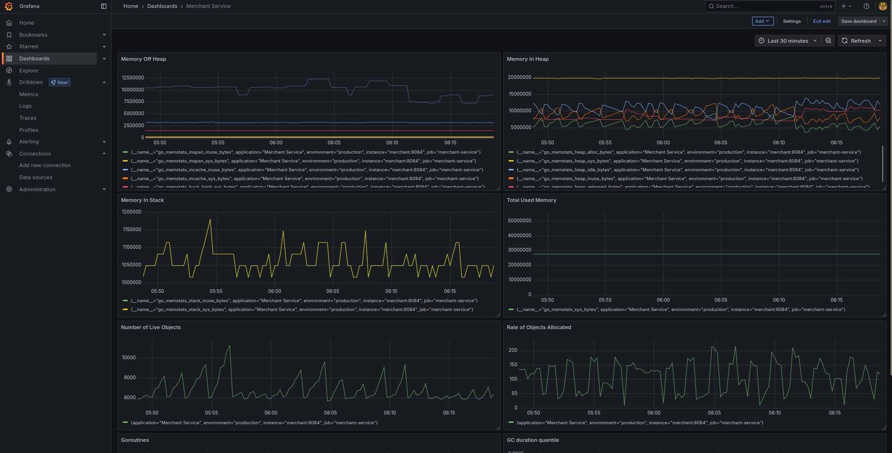

#### Card Service

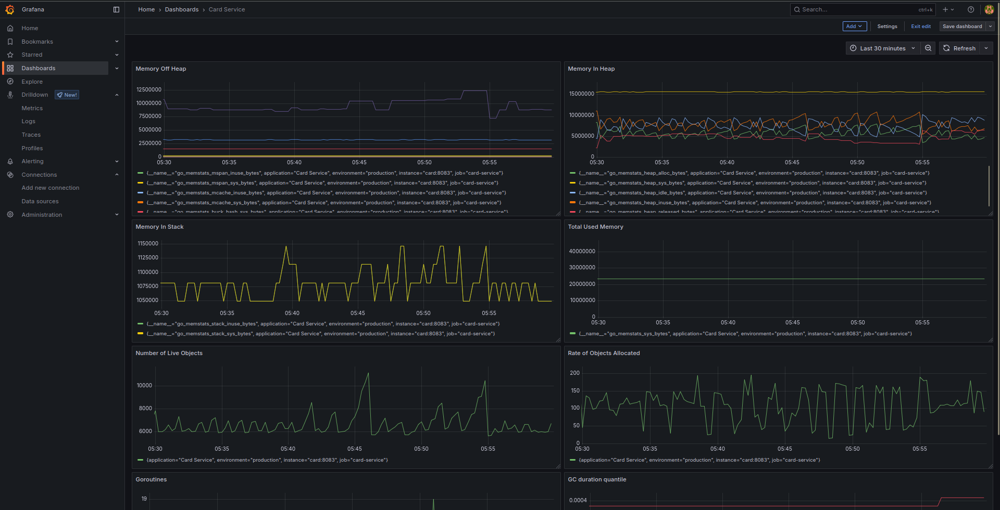


#### Saldo Service

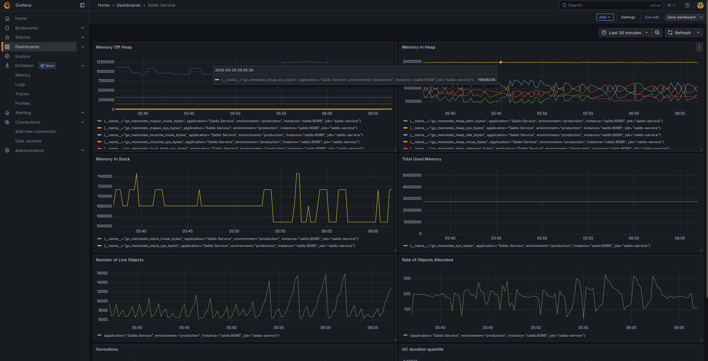


#### Topup Service

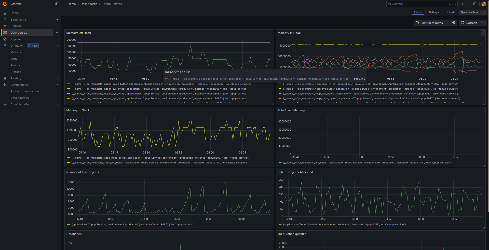


#### Transaction Service

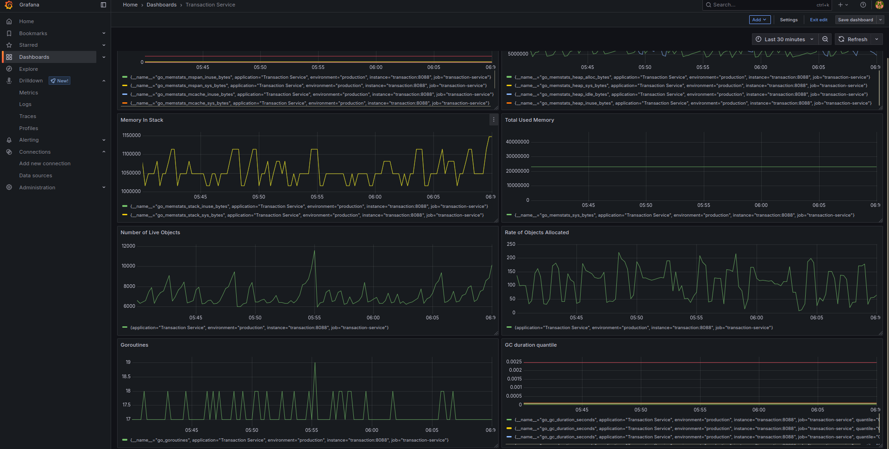


#### Transfer Service

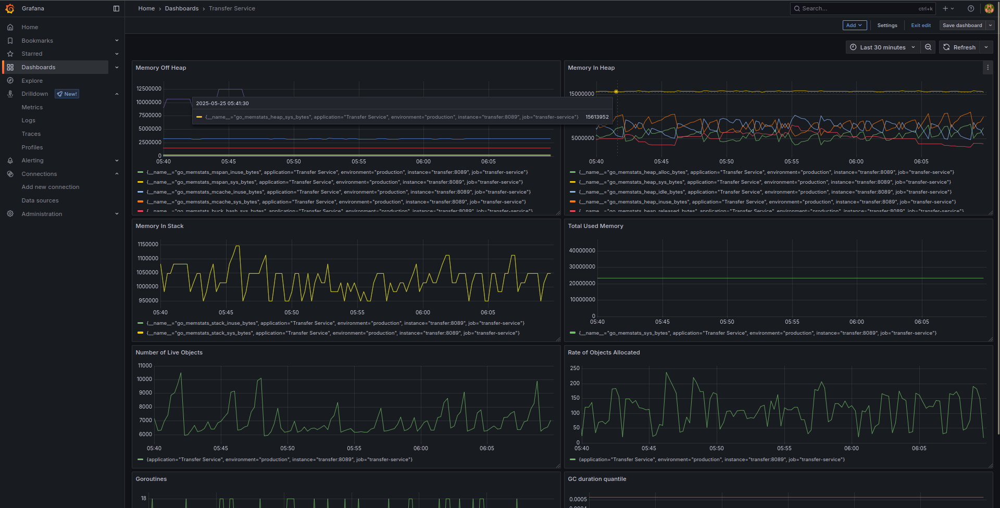

#### Withdraw Service

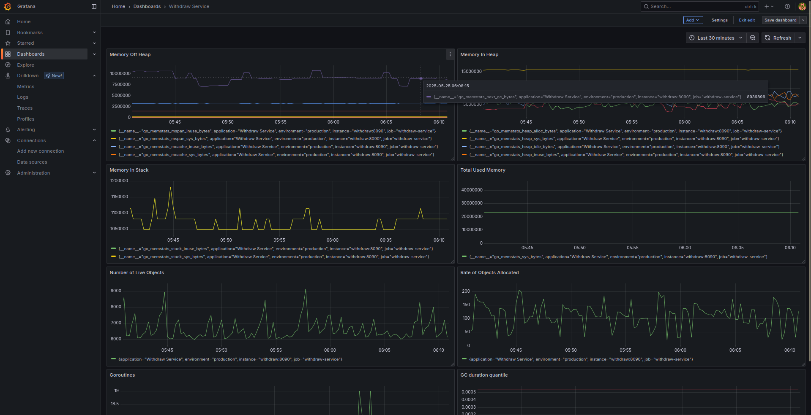


## 📦 Go Runtime Metrics – Memory & GC

### 🔧 Memory: Off-Heap

- **`go_memstats_mspan_inuse_bytes`**
  Number of bytes currently in use by the internal *mspan* structure (used for managing memory spans).

- **`go_memstats_mspan_sys_bytes`**
  Total bytes allocated from the system for *mspan*, including unused space.

- **`go_memstats_mcache_inuse_bytes`**
  Bytes used by the thread-local memory allocator cache (*mcache*).

- **`go_memstats_mcache_sys_bytes`**
  Total bytes allocated from the system for *mcache*, used to accelerate small object allocations.

- **`go_memstats_buck_hash_sys_bytes`**
  Bytes used by internal bucket hash structures (used for maps, profiling, etc.).

- **`go_memstats_gc_sys_bytes`**
  Bytes allocated from the system for the Garbage Collector, including GC-related metadata.

- **`go_memstats_other_sys_bytes`**
  Other system memory allocations by the Go runtime that don’t fall under any specific category.

---

### 🧠 Memory: In-Heap

- **`go_memstats_heap_alloc_bytes`**
  Bytes currently allocated in the heap for active (reachable) objects.

- **`go_memstats_heap_sys_bytes`**
  Total heap bytes requested from the OS (used or unused).

- **`go_memstats_heap_idle_bytes`**
  Heap memory that is not currently in use and may be returned to the OS.

- **`go_memstats_heap_inuse_bytes`**
  Heap memory actively being used by Go objects.

- **`go_memstats_heap_released_bytes`**
  Heap memory that has been returned to the OS by the Go runtime.

---

### 📚 Memory: Stack

- **`go_memstats_stack_inuse_bytes`**
  Bytes used by active goroutine stacks.

- **`go_memstats_stack_sys_bytes`**
  Total stack memory allocated from the system for all goroutines.

---

### 📊 Memory: Total Usage

- **`go_memstats_sys_bytes`**
  Total bytes allocated from the OS by the Go runtime (includes heap, stack, off-heap, etc.).

---

### 🔢 Live Object Counter

- **`go_memstats_mallocs_total - go_memstats_frees_total`**
  Number of live (active) objects in memory. Calculated as total allocations minus total frees.

---

### 📈 Allocation Rate

- **`rate(go_memstats_mallocs_total[1m])`**
  Average object allocation rate per second over the last 1 minute.

---

### 🧵 Goroutines

- **`go_goroutines`**
  Number of currently active goroutines in the application.

---

### ♻️ Garbage Collection (GC)

- **`go_gc_duration_seconds`**
  Histogram of GC durations in seconds. Measures time spent during each GC cycle.
