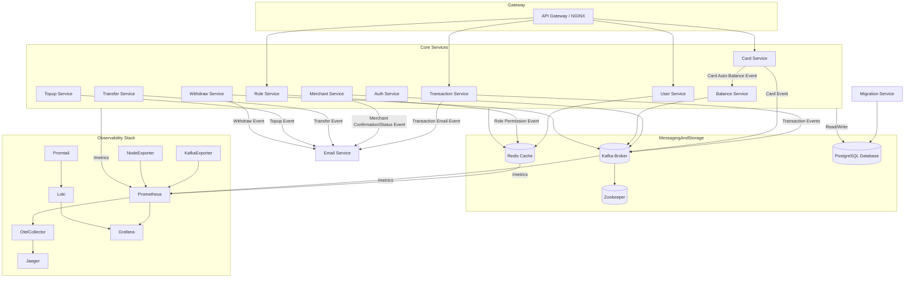
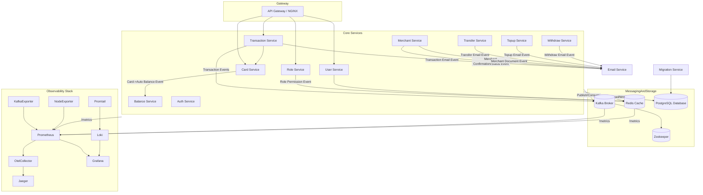

# Digital Payment Platform

The **Digital Payment Platform** is a reliable, scalable, and secure integrated system designed to streamline various digital financial transactions. Built using a monolithic architecture, all core functionalities—such as card management, transactions, fund transfers, and merchant interactions—are consolidated within a single application. This approach simplifies development, testing, and deployment, enabling consistent and efficient delivery of digital payment services within a unified environment.


## 🛠️ Technologies Used
- 🚀 **gRPC** — Provides high-performance, strongly-typed APIs.
- 📡 **Kafka** — Used to publish balance-related events (e.g., after card creation).
- 📈 **Prometheus** — Collects metrics like request count and latency for each RPC method.
- 🛰️ **OpenTelemetry (OTel)** — Enables distributed tracing for observability.
- 🦫 **Go (Golang)** — Implementation language.
- 🌐 **Echo** — HTTP framework for Go.
- 🪵 **Zap Logger** — Structured logging for debugging and operations.
- 📦 **Sqlc** — SQL code generator for Go.
- 🧳 **Goose** — Database migration tool.
- 🐳 **Docker** — Containerization tool.
- 🧱 **Docker Compose** — Simplifies containerization for development and production environments.
- 🐘 **PostgreSQL** — Relational database for storing user data.
- 📃 **Swago** — API documentation generator.
- 🧭 **Zookeeper** — Distributed configuration management.
- 🔀 **Nginx** — Reverse proxy for HTTP traffic.
- 🔍 **Jaeger** — Distributed tracing for observability.
- 📊 **Grafana** — Monitoring and visualization tool.
- 🧪 **Postman** — API client for testing and debugging endpoints.
- ☸️ **Kubernetes** — Container orchestration platform for deployment, scaling, and management.
- 🧰 **Redis** — In-memory key-value store used for caching and fast data access.
- 📥 **Loki** — Log aggregation system for collecting and querying logs.
- 📤 **Promtail** — Log shipping agent that sends logs to Loki.
- 🔧 **OTel Collector** — Vendor-agnostic collector for receiving, processing, and exporting telemetry data (metrics, traces, logs).
- 🖥️ **Node Exporter** — Exposes system-level (host) metrics such as CPU, memory, disk, and network stats for Prometheus.


----

## Getting Started

Follow these instructions to get the project up and running on your local machine for development and testing purposes.

### Prerequisites

Make sure you have the following tools installed:
-   [Git](https://git-scm.com/)
-   [Go](https://go.dev/) (version 1.20+)
-   [Docker](https://www.docker.com/)
-   [Docker Compose](https://docs.docker.com/compose/)
-   [Make](https://www.gnu.org/software/make/)

### 1. Clone the Repository

```sh
git clone https://github.com/your-username/monolith-payment-gateway-grpc.git
cd monolith-payment-gateway-grpc
```

### 2. Environment Configuration

The project uses environment files for configuration. You'll need to create the necessary `.env` files.
*   Create a `.env` file in the root directory for general settings.
*   Create a `docker.env` file in `deployments/local/` for Docker-specific settings.

You can copy the example files if they exist, or create them from scratch.

### 3. Run the Application

The following commands will build the Docker images, start all services, and prepare the database.

**1. Build images and launch services:**
This command builds all service images and starts the entire infrastructure (including databases, Kafka, etc.) using Docker Compose.

```sh
make build-up
```

**2. Run Database Migrations:**
Once the containers are running, apply the database schema migrations.

```sh
make migrate
```

**3. Seed the Database (Optional):**
To populate the database with initial data for testing, run the seeder.

```sh
make seeder
```

The platform should now be fully operational. You can check the status of the running containers with `make ps`.

### Stopping the Application

To stop and remove all running containers, use the following command:

```sh
make down
```


----

## Architecture Overview

This Digital Payment Platform is designed as a **modular monolithic system**. While the business logic is organized into distinct services (e.g., `user`, `transaction`, `card`), they are developed within a single codebase. This approach combines the simplicity of a monolith with the organizational benefits of service-oriented architecture.

The system is designed to be deployed using containerization, with separate containers for each service. This allows for independent scaling and management of components in a production-like environment.

### Key Architectural Concepts:

*   **API Gateway**: A single entry point for all client requests. It routes traffic to the appropriate backend service, handles authentication, and provides a unified API.
*   **gRPC for Inter-Service Communication**: High-performance gRPC is used for communication between internal services, ensuring low latency and strongly-typed contracts.
*   **Asynchronous Messaging with Kafka**: Kafka is used for event-driven communication, decoupling services and improving resilience. For example, when a new card is created, a message is published to a Kafka topic, which is then consumed by the `saldo` service to update the balance.
*   **Centralized Observability**: The platform integrates a comprehensive observability stack:
    *   **Prometheus** for collecting metrics.
    *   **Jaeger** (via OpenTelemetry) for distributed tracing.
    *   **Loki** and **Promtail** for log aggregation.
    *   **Grafana** for visualization of metrics, traces, and logs.

### Deployment Architecture

The platform is designed to run in containerized environments. We provide configurations for both Docker Compose (for local development) and Kubernetes (for a production-like setup).

#### Docker Environment

The Docker setup uses `docker-compose` to orchestrate all the services, databases, and tools needed for a complete local development environment.



#### Kubernetes Environment

The Kubernetes setup provides a scalable and resilient deployment. Each service runs in its own set of Pods, with Horizontal Pod Autoscalers (HPAs) for automatic scaling based on load.



# How to Run

## 1. Clone Repository

```bash
git clone https://github.com/MamangRust/monolith-payment-gateway-grpc.git
cd monolith-payment-gateway-grpc
```

## 2. Running Locally with Docker Compose

To run all services locally, you can use Docker Compose.

```bash
make build-up
```

This command will build images for each service and run them in the background.

To stop all services, run the following command:

```bash
make down
```

## 3. Running on Kubernetes

To run all services on Kubernetes, you can use Minikube.

```bash
make kube-start
make kube-up
```

This command will start Minikube and apply all Kubernetes configurations located in the `deployments/kubernetes` directory.

To stop all services on Kubernetes, run the following command:

```bash
make kube-down
```

## 4. Generate Code from Protobuf

**Important:** This project does not include `.proto` files. You must add your own `.proto` files to the `proto/` directory.

After adding your `.proto` files, run the following command to generate Go code from your `.proto` files:

```bash
make generate-proto
```

## 5. Generate Code from SQL

To generate Go code from SQL files, run the following command:

```bash
make generate-sql
```

## 6. Running Database Migration

To run database migration, execute the following command:

```bash
make migrate
```

## 7. Running Seeder

To populate the database with initial data, run the following command:

```bash
make seeder
```

## 8. Running Tests

To run tests on the `auth` service, execute the following command:

```bash
make test-auth
```

## Makefile

This project comes with a `Makefile` containing various commands to facilitate development. Here are some available commands:

- `make migrate`: Run database migration
- `make migrate-down`: Rollback database migration
- `make generate-proto`: Generate Go code from `.proto` files
- `make generate-sql`: Generate Go code from SQL files
- `make generate-swagger`: Generate Swagger documentation
- `make seeder`: Populate database with initial data
- `make build-image`: Build Docker images for all services
- `make image-load`: Load Docker images to Minikube
- `make image-delete`: Delete Docker images from Minikube
- `make ps`: Display Docker container status
- `make up`: Run all services with Docker Compose
- `make down`: Stop all services running with Docker Compose
- `make build-up`: Build images and run all services with Docker Compose
- `make kube-start`: Start Minikube
- `make kube-up`: Run all services on Kubernetes
- `make kube-down`: Stop all services on Kubernetes
- `make kube-status`: Display status of pods, services, PVCs, and jobs on Kubernetes
- `make kube-tunnel`: Create tunnel to Minikube
- `make test-auth`: Run tests on the `auth` service


## Screenshoot

### API Documentation


### ERD Documentation


### Grafana Dashboard(Prometheus & OpenTelemetry(Jaeger))

#### Node Exporter


#### Email Service


#### Auth Service


#### User Service


#### Role Service


#### Merchant Service


#### Card Service


#### Saldo Service


#### Topup Service


#### Transaction Service


#### Transfer Service


#### Withdraw Service


