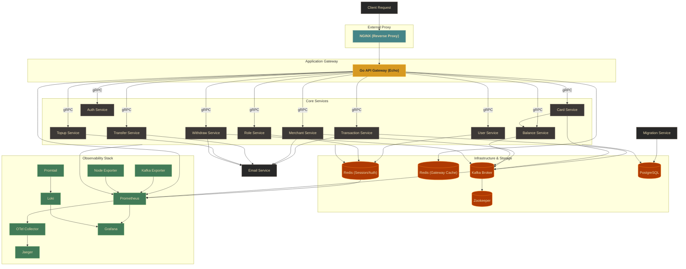
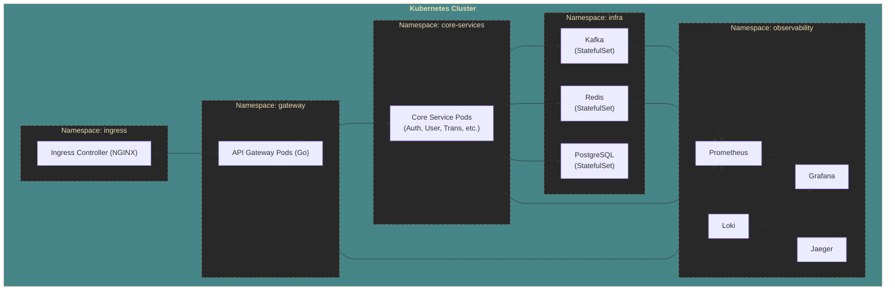
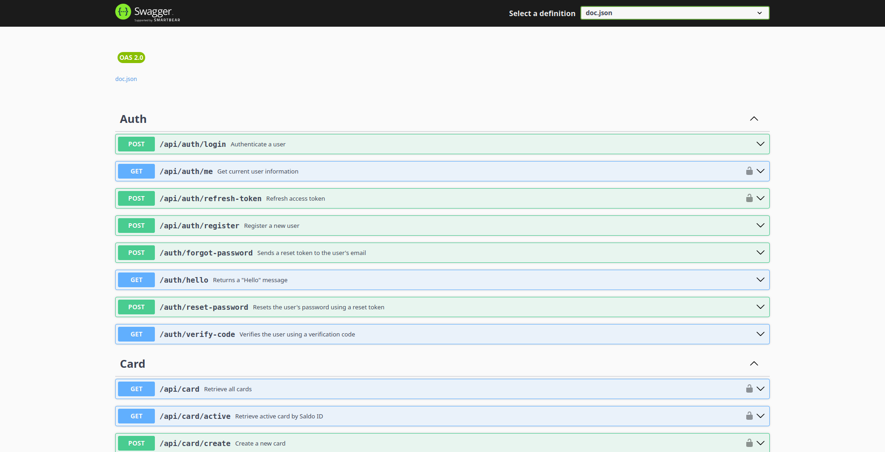
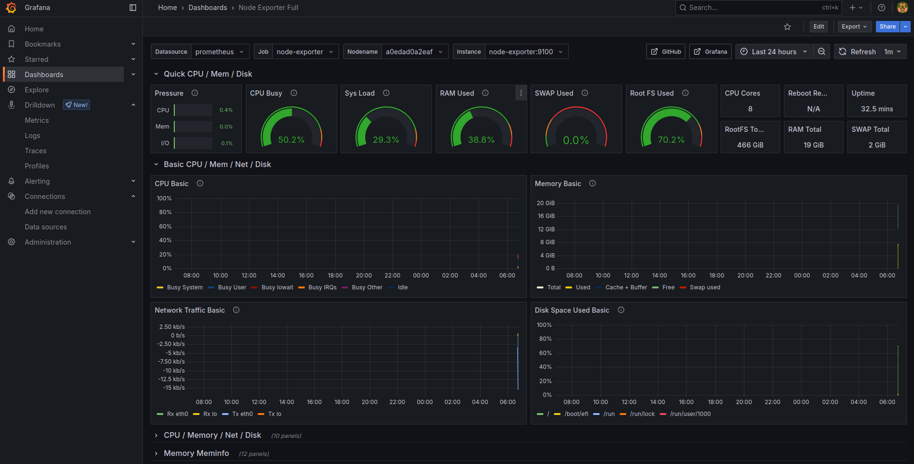
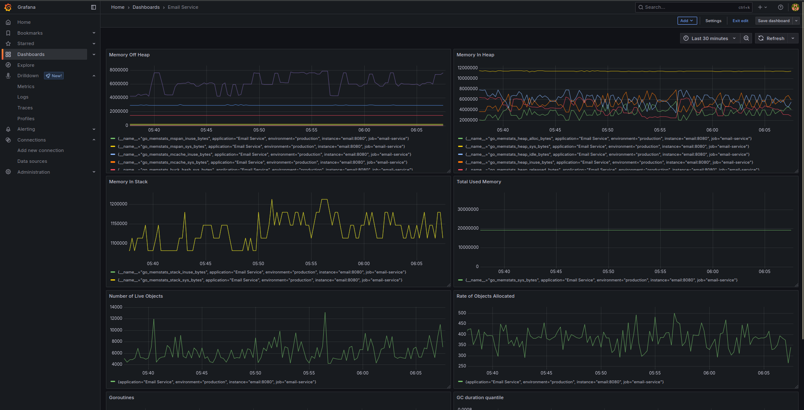
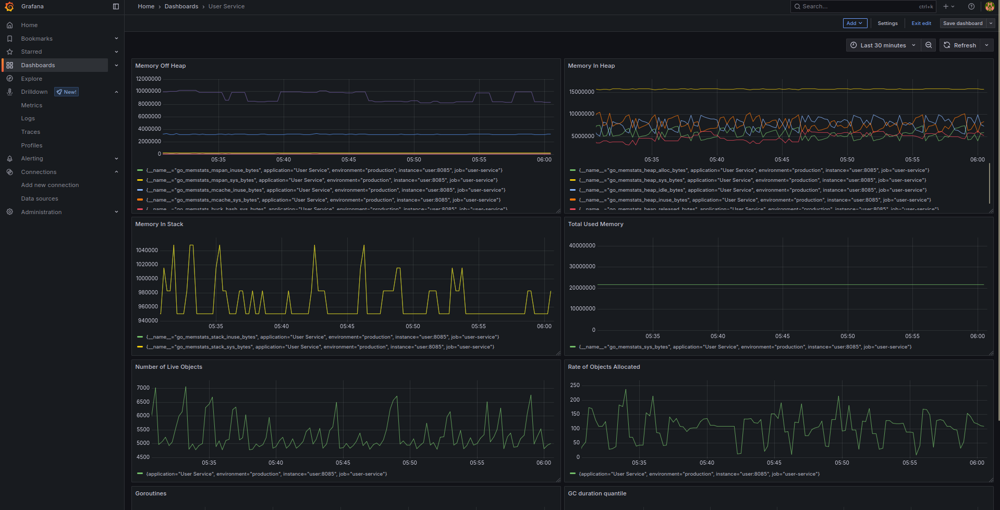
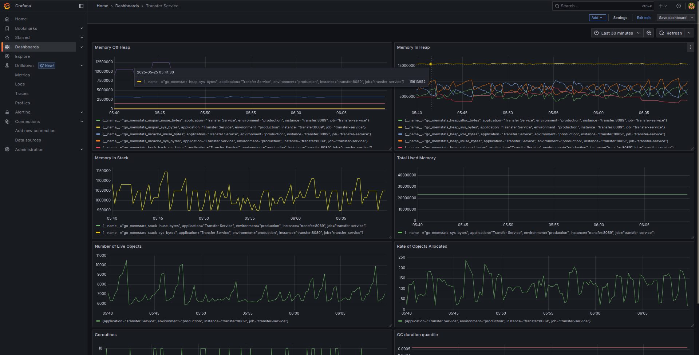

# Distributed Modular Monolith Payment Gateway

This repository contains the implementation of a Distributed Modular Monolith Payment Gateway. The architecture is designed to provide a secure, scalable, and modular backend for managing financial transactions, merchant operations, card management, and settlement workflows.

Unlike traditional monolithic applications, this system is organized into well-defined modules (services) including Auth, User, Role, Card, Balance, Transaction, Merchant, Transfer, Topup, and Withdraw. Internal communication is handled via gRPC, while external access is managed through an API Gateway (NGINX). Asynchronous workflows, such as settlements and notifications, are driven by events published to Kafka.

## Infrastructure Overview

The system integrates several core infrastructure components:

*   **PostgreSQL**: Primary relational database for persistence.
*   **Redis**: High-performance caching and real-time session management.
*   **Kafka**: Distributed event bus for asynchronous, event-driven processing.
*   **Email Service**: Automated transactional notifications and confirmations.
*   **Observability Stack**: A comprehensive suite including Prometheus, Grafana, Loki, Jaeger, and OpenTelemetry for monitoring, logging, and distributed tracing.

## Deployment Options

### Docker Compose
Recommended for local development and integration testing. It orchestrates the API Gateway, core services, and all infrastructure components (Kafka, PostgreSQL, Redis, etc.) in a single environment.

### Kubernetes
Designed for production-grade environments. Features include:
*   Service isolation within dedicated pods.
*   Horizontal Pod Autoscaling (HPA) for critical services like Transaction and Balance.
*   Resilient infrastructure management for Kafka, Redis, and PostgreSQL.
*   Automated database migration jobs.
*   Centralized observability via DaemonSets for logs, metrics, and traces.

## Key Features

### Authentication and Access Control
*   Secure user authentication using JWT.
*   Granular Role-Based Access Control (RBAC) (Admin, Merchant, Customer, System).
*   High-speed permission lookups via Redis caching.

### Card and Balance Management
*   Full card lifecycle management and registration.
*   Event-driven balance updates triggered by card activities.
*   Consistent state management across balance services.

### Transaction Processing
*   Comprehensive support for payment creation, settlement, and refunds.
*   Downstream event publishing via Kafka.
*   Real-time transaction confirmations delivered via email.

### Financial Operations
*   Peer-to-peer and merchant transfer services.
*   Account funding via dedicated top-up services.
*   Merchant and customer withdrawal management.
*   Automated email notifications for all financial operations.

### Merchant Services
*   Onboarding and verification workflows.
*   Automated status updates and document processing.
*   Integrated settlement flows connected to Transaction and Balance services.

### Event-Driven Architecture
*   Decoupled service interaction using Kafka.
*   Background processing for non-blocking operations.
*   Optimized data access using Redis.

### System Observability
*   Standardized metrics collection via Prometheus.
*   Log aggregation and querying using Promtail and Loki.
*   Distributed tracing with OpenTelemetry and Jaeger.
*   Pre-configured Grafana dashboards for system health visualization.

## Technical Stack

*   **Go (Golang)**: Core implementation language.
*   **gRPC**: High-performance, strongly-typed inter-service communication.
*   **Kafka**: Distributed event streaming.
*   **PostgreSQL**: Relational data storage.
*   **Redis**: In-memory data store for caching and sessions.
*   **OpenTelemetry (OTel)**: Standardized telemetry data collection.
*   **Prometheus**: Metrics monitoring.
*   **Grafana**: Visualization and dashboarding.
*   **Loki / Promtail**: Log management.
*   **Jaeger**: Distributed tracing backend.
*   **Nginx**: API Gateway and reverse proxy.
*   **Kubernetes**: Container orchestration.
*   **Docker / Docker Compose**: Containerization and local orchestration.
*   **Sqlc**: Type-safe SQL code generation.
*   **Goose**: Database migration management.
*   **Echo**: High-performance web framework.
*   **Zap**: Structured logging.
*   **Swago**: API documentation generation.

## Getting Started

### Prerequisites

Ensure the following tools are installed:
*   Git
*   Go (version 1.20+)
*   Docker and Docker Compose
*   Make

### Installation

1.  **Clone the Repository**
    ```bash
    git clone https://github.com/MamangRust/monolith-payment-gateway-grpc.git
    cd monolith-payment-gateway-grpc
    ```

2.  **Environment Configuration**
    *   Create a `.env` file in the root directory for general settings.
    *   Create a `docker.env` file in `deployments/local/` for Docker-specific configurations.

3.  **Run the Application**
    Initialize the infrastructure and start the services:
    ```bash
    make build-up
    ```

4.  **Database Migration**
    Apply the database schema:
    ```bash
    make migrate
    ```

5.  **Seed Data (Optional)**
    Populate the database with initial test data:
    ```bash
    make seedere
    ```

Check service status using `make ps`.

### Stopping the Application

To stop and remove all running containers:
```bash
make down
```

## Architecture

The platform follows a **Modular Monolith** pattern. While all services reside within a single codebase for development simplicity, they are logically separated and deployed as independent containers. This approach combines the ease of monolithic development with the scalability of microservices.

### Core Architecture Principles

*   **Layered API Gateway**:
    *   **NGINX (External Gateway)**: Acts as the primary entry point and reverse proxy. It handles SSL termination, load balancing, and routes external traffic to the Go-based API Gateway.
    *   **Go API Gateway (Business Gateway)**: A high-performance Go service (Echo-based) that orchestrates business logic by aggregating multiple internal gRPC services. It manages authentication, request validation, and caching.
*   **Inter-Service Communication**: Low-latency, strongly-typed communication via gRPC.
*   **Event-Driven Communication**: Decoupled service interaction using Kafka for background tasks and cross-service updates.
*   **Centralized Observability**: Integrated telemetry (metrics, logs, traces) visualized through Grafana.

### System Component Diagram (Local Development)


```mermaid
flowchart TD
    subgraph Proxy["External Proxy"]
        NGINX["NGINX (Reverse Proxy)"]
    end

    subgraph Gateway["Application Gateway"]
        APIG["Go API Gateway (Echo)"]
    end

    subgraph CoreServices["Core Services"]
        direction TB
        TS["Transaction Service"]
        CS["Card Service"]
        US["User Service"]
        RS["Role Service"]
        MS["Merchant Service"]
        BS["Balance Service"]
        AS["Auth Service"]
        TRS["Transfer Service"]
        TUS["Topup Service"]
        WS["Withdraw Service"]
    end

    subgraph Storage["Infrastructure & Storage"]
        Kafka[("Kafka Broker")]
        ZK[("Zookeeper")]
        RedisAPIG[("Redis (Gateway Cache)")]
        RedisCore[("Redis (Session/Auth)")]
        DB[("PostgreSQL")]
    end

    subgraph Observability["Observability Stack"]
        Promtail["Promtail"]
        KafkaExporter["Kafka Exporter"]
        NodeExporter["Node Exporter"]
        Prometheus["Prometheus"]
        Loki["Loki"]
        OtelCollector["OTel Collector"]
        Grafana["Grafana"]
        Jaeger["Jaeger"]
    end

    EmailS["Email Service"]
    Migration["Migration Service"]

    %% Traffic Flow
    Client["Client Request"] --> NGINX
    NGINX --> APIG
    APIG -->|gRPC| TS & CS & US & RS & MS & BS & AS & TRS & TUS & WS
    
    APIG --> RedisAPIG

    TS --> Kafka
    TS --> EmailS
    CS --> BS
    CS --> Kafka
    US --> RedisCore
    RS --> RedisCore
    MS --> EmailS & Kafka
    BS --> Kafka
    TRS --> EmailS
    TUS --> EmailS
    WS --> EmailS & Kafka

    CoreServices --> DB
    Migration --> DB
    Kafka --> ZK
    CoreServices --> RedisCore

    %% Observability Connections
    CoreServices & APIG & RedisCore & Kafka --> Prometheus
    Promtail --> Loki
    KafkaExporter & NodeExporter --> Prometheus
    Prometheus & Loki --> Grafana
    Prometheus --> OtelCollector --> Jaeger

    %% Styling
    classDef default fill:#282828,stroke:#928374,color:#ebdbb2;
    classDef proxy fill:#458588,stroke:#83a598,color:#ebdbb2,font-weight:bold;
    classDef gateway fill:#d79921,stroke:#fabd2f,color:#282828,font-weight:bold;
    classDef secondary fill:#3c3836,stroke:#7c6f64,color:#ebdbb2;
    classDef infra fill:#af3a03,stroke:#fe8019,color:#ebdbb2;
    classDef obs fill:#427b58,stroke:#8ec07c,color:#ebdbb2;

    class NGINX proxy;
    class APIG gateway;
    class TS,CS,US,RS,MS,BS,AS,TRS,TUS,WS secondary;
    class Kafka,ZK,RedisAPIG,RedisCore,DB infra;
    class Prometheus,Loki,Grafana,Jaeger,OtelCollector,Promtail,KafkaExporter,NodeExporter obs;
```

### Kubernetes Deployment Topology


```mermaid
flowchart TD
    subgraph K8s["Kubernetes Cluster"]
        subgraph IngressNS["Namespace: ingress"]
            NGINX["Ingress Controller (NGINX)"]
        end

        subgraph GatewayNS["Namespace: gateway"]
            APIG["API Gateway Pods (Go)"]
        end

        subgraph CoreNS["Namespace: core-services"]
            direction LR
            Services["Core Service Pods\n(Auth, User, Trans, etc.)"]
        end

        subgraph InfraNS["Namespace: infra"]
            Kafka["Kafka\n(StatefulSet)"]
            Redis["Redis\n(StatefulSet)"]
            DB["PostgreSQL\n(StatefulSet)"]
        end

        subgraph ObsNS["Namespace: observability"]
            Prometheus["Prometheus"]
            Loki["Loki"]
            Grafana["Grafana"]
            Jaeger["Jaeger"]
        end
    end

    NGINX --> APIG
    APIG --> Services
    Services --> Kafka & Redis & DB
    Services & APIG & Kafka & Redis --> Prometheus
    Prometheus & Loki --> Grafana

    classDef k8s fill:#458588,stroke:#ebdbb2,color:#ebdbb2,font-weight:bold;
    classDef ns fill:#282828,stroke:#928374,color:#ebdbb2,stroke-dasharray: 5 5;
    
    class K8s k8s;
    class IngressNS,GatewayNS,CoreNS,InfraNS,ObsNS ns;
```

## Maintenance Operations

Manage the platform using the provided `Makefile` commands:

### Development Workflow
*   `make generate-proto`: Generate Go code from Protobuf definitions.
*   `make generate-sql`: Generate SQL helper code via sqlc.
*   `make generate-swagger`: Refresh API documentation.

### Database Management
*   `make migrate`: Apply database migrations.
*   `make migrate-down`: Revert database migrations.
*   `make seeder`: Populate database with test data.

### Infrastructure Control
*   `make build-up`: Build images and start local containers.
*   `make down`: Stop local development environment.
*   `make ps`: View running container status.

### Kubernetes Operations
*   `make kube-start`: Initialize local Minikube cluster.
*   `make kube-up`: Deploy application to Kubernetes.
*   `make kube-down`: Remove application from Kubernetes.
*   `make kube-status`: Check Kubernetes resource status.

## Monitoring and Visualization

The platform provides extensive dashboards for real-time monitoring:

### API Documentation


### Database Schema (ERD)


### Observability Dashboards

*   **System Performance**: Resource utilization (CPU, Memory, Network).
*   **Auth & User Services**: Identity management and session metrics.
*   **Transaction Flow**: Real-time payment processing and settlement status.
*   **Balance & Financial Stats**: Account state and operational metrics.

#### Node Exporter


#### Email Service


#### Authentication Service


#### User Service


#### Transaction Service


#### Transfer Service


#### Withdrawal Service
